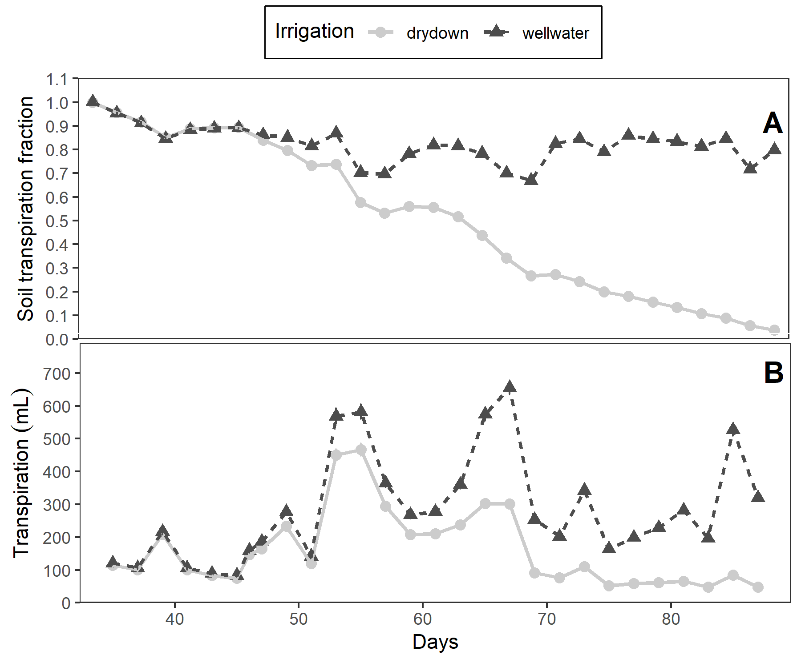
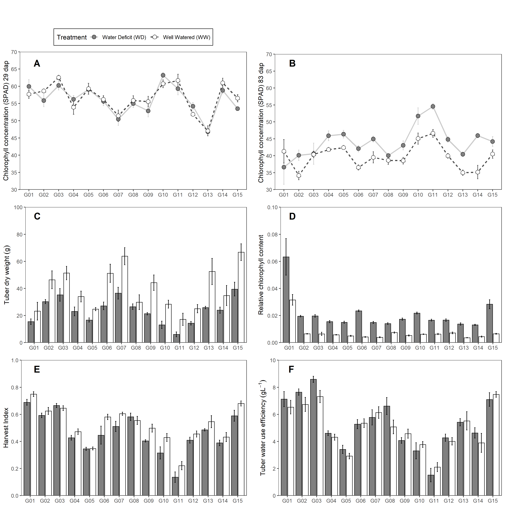
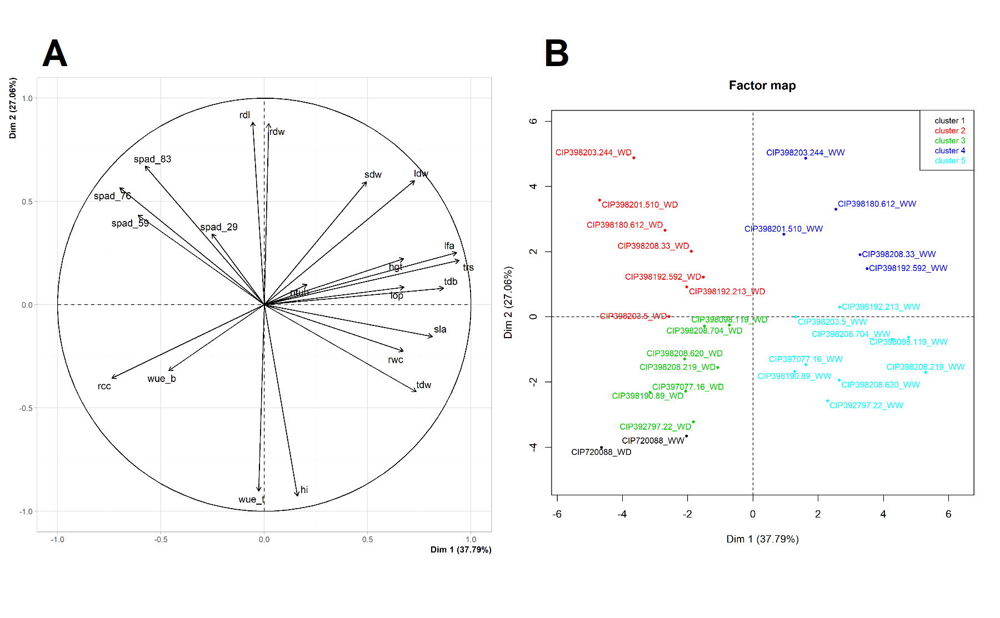
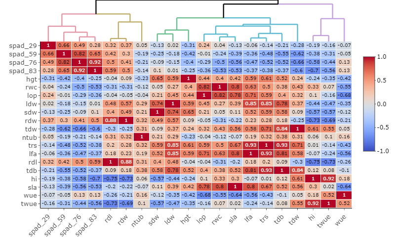
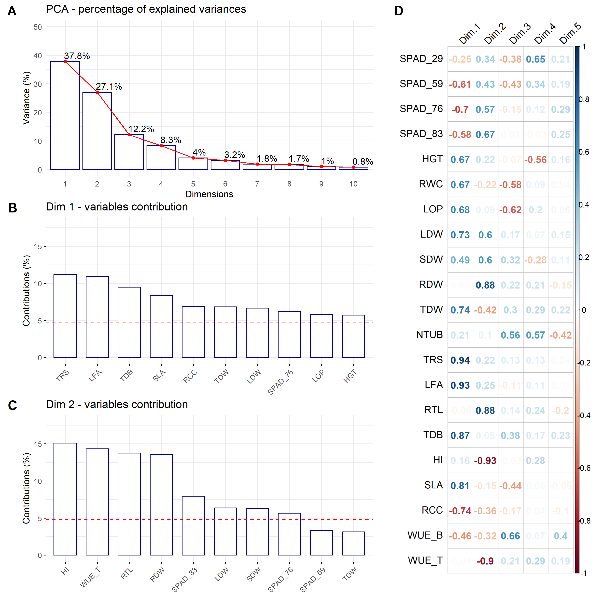
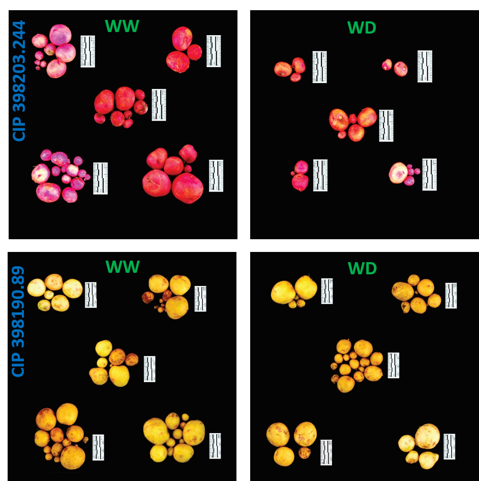

```{r import, include=FALSE}
source("https://lozanoisla.com/setup.r")
source("https://lozanoisla.com/rticles.r")
library(GerminaR)
library(gtsummary)
url <- "https://docs.google.com/spreadsheets/d/1dfgpmCKdPmxRHozrZp0iE_xMGsvKTIcztDpMWYSEGaY/edit#gid=142311263"
gs <- as_sheets_id(url)
# browseURL(url)
xl <- gs %>% drive_download("files/fieldbook.xlsx", overwrite = T) %>% pluck(2)

fb <- xl %>% 
  readxl::read_excel("fb") %>% 
  select_all("tolower") %>%
  select_all(~gsub("\\s+|\\.", "_", .)) %>% 
  mutate(treat = ifelse(treat == "wellwater", "WW", "WD")) %>% 
  select(block, treat, genotype,
         spad_29 = spad_29dap, 
         spad_59 = spad_59dap, 
         spad_76 = spad_76dap, 
         spad_83 = spad_83dap,
         hgt = hgt_86dap,
         rwc = rwc_84dap,
         lop = op_84dap,
         ldw = leafdw,
         sdw = stemdw,
         rdw = rootdw,
         tdw = tubdw,
         ntub,
         trs = ttrns,
         lfa = la,
         rdl = rlg
         ) %>% 
  mutate(tdb = (ldw+sdw+rdw+tdw),
         hi = tdw/(ldw+sdw+rdw+tdw),
         sla = lfa/ldw,
         rcc = (spad_83/lfa)*100,
         wue_b = (ldw+sdw+rdw+tdw)/trs,
         wue_t = tdw/trs
         ) %>% 
  mutate(gnt = recode(genotype, 
                      "CIP720088" = "G01",
                      "CIP392797.22" = "G02",
                      "CIP397077.16" = "G03",
                      "CIP398192.213" = "G04",
                      "CIP398180.612" = "G05",
                      "CIP398208.704" = "G06",
                      "CIP398098.119" = "G07",
                      "CIP398190.89" = "G08",
                      "CIP398192.592" = "G09",
                      "CIP398201.510" = "G10",
                      "CIP398203.244" = "G11",
                      "CIP398203.5" = "G12",
                      "CIP398208.219" = "G13",
                      "CIP398208.33" = "G14",
                      "CIP398208.620" = "G15")) %>% 
  select(genotype, gnt, treat, block, everything()) %>% 
  mutate_if(is.character, as.factor) 

```

`r if (knitr::is_html_output()){'
# Tables {-}
'}`

```{r abrv, eval=FALSE, include=FALSE}
xl %>%
  readxl::read_excel(sheet = "var") %>%
  filter(include == "x") %>%
  select(Variable, Abbreviation) %>%
  mutate_at("Abbreviation", "tolower") %>%
  kable(caption = "List of abbreviations")
```

\newpage

```{r gnt}

xl %>% 
  readxl::read_excel("gnt") %>% 
  dplyr::select(Number, Genotypes, Adaptability, "Growning period" = GPL, "Heat tolerance" = Heat, "Dry matter (%)") %>% 
  kable(caption = "Potato genotypes (*Solanum tuberosum* L.) used for water deficit experiment with two commercial varieties and 13 genotypes from advanced breeding population developed by the International Potato Center (CIP).")

```

\newpage

```{r svt}
smr.trt <- fb %>%
  select(-block, -gnt, -genotype) %>% 
  tbl_summary(
    by = treat, 
    statistic = list(all_continuous() ~ "{mean} ± {sd}"),
    missing = "no") %>% 
  add_p() %>% 
  bold_labels() %>% 
  as_tibble() %>% 
  mutate(`**Characteristic**` = recode(
    `**Characteristic**`
    , "__spad_29__" = "Chlorophyll Concentration (spad) at 29 DAP"
    , "__spad_59__" = "Chlorophyll Concentration (spad) at 59 DAP"
    , "__spad_76__" = "Chlorophyll Concentration (spad) at 76 DAP"
    , "__spad_83__" = "Chlorophyll Concentration (spad) at 83 DAP"
    , "__hgt__" = "Plant height (cm)"
    , "__rwc__" = "Relative water content (%)"
    , "__lop__" = "Leaf osmotic potential (MPa)"
    , "__ldw__" = "Leaf dry weight (g)"
    , "__sdw__" = "Stem dry weight (g)"
    , "__rdw__" = "Root dry weight (g)"
    , "__tdw__" = "Tuber dry weight (g)"
    , "__ntub__" = "Tuber number (N°)" 
    , "__trs__" = "Total transpiration (mL)"
    , "__lfa__" = "Leaf area (cm^2^)"
    , "__rdl__" = "Root length (cm)"
    , "__tdb__" = "Total dry biomass (g)"
    , "__hi__"  = "Harvest Index (hi)" 
    , "__sla__" = "Specific Leaf Area (cm^2^g^-1^)"
    , "__rcc__" = "Relative Chlorophyll Content (rcc)"
    , "__wue_b__" = "Biomass water use efficiency (gL^-1^)"
    , "__wue_t__" = "Tuber Water Use Efficiency (gL^-1^)"
    )) %>% 
  rename(`**Variable**` = `**Characteristic**`) %>% 
  knitr::kable(caption = "Treatment comparison for seventeen variables between Well-Watered (WW) and Water Deficit (WD) in 15 potato genotypes. The values are represented by the mean ± standard deviation with the significance under t-test with their respective p-values.")

smr.trt

```

`r if (knitr::is_html_output()){'
# Figures {-}
'}`

```{r srl, fig.cap= "(A) Soil transpiration fraction (ftsw) and (B) Daily transpiration in 15 potato genotypes under well-watered (WW) and water deficit (WD) condition."}

fts <- xl %>% 
  readxl::read_excel("ftsw") %>%
  filter(Treatment != "preharvest") %>%
  tidyr::gather(key = day, value = fts, -ID, -Genotype, -Treatment)

av <- aov(fts ~ Treatment*day, fts)
mc <- GerminaR::ger_testcomp(av, c("Treatment", "day"))

plt1 <- fplot(data = mc, type = "line", color = F,
             x = "day",
             y = "mean",
             z = "Treatment",
             ylab = "Soil transpiration fraction",
             xlab =  "Days",
             lgl = "Irrigation",
             zbl = "water deficit  well watered",
             lgd = "top",
             lmt = c(0,1.1),
             brk = 0.1,
             erb =  T) +
  theme(axis.title.x=element_blank(),
        axis.text.x=element_blank(),
        axis.ticks.x=element_blank())

trns <- xl %>% 
  readxl::read_excel("trans") %>%
  filter(Treatment != "preharvest") %>%
  tidyr::gather(key = day, value = trans, -ID, -Genotype, -Treatment) %>%
  filter(day != "TOTAL") %>%
  drop_na()

av <- aov(trans ~ Treatment*day, trns)
mc <- GerminaR::ger_testcomp(av, c("Treatment", "day")) %>% 
  mutate_at("day", as.numeric)

plt2 <- fplot(data = mc, type = "line", color = F,
             x = "day",
             y = "mean",
             z = "Treatment",
             ylab = "Transpiration (mL)",
             xlab =  "Days",
             lgl = "Irrigation",
             zbl = "water deficit  well watered",
             lgd = "none",
             lmt = c(0,790),
             brk = 100,
             erb =  T)

plot <- ggdraw(xlim = c(0, 0.5), ylim = c(0,0.8))+
  draw_plot(plt1,  width = 0.494, height = 0.43, x = 0.00555, y = 0.362) +
  draw_plot(plt2,  width = 0.5, height = 0.4, x = 0.0, y = 0.0) +
          draw_plot_label(
            label = c("A", "B"),
            x = c(0.47, 0.47),
            y = c(0.68, 0.38))

save_plot(plot = plot, "files/fig_srl.png")


```

\newpage

```{r mpv, fig.cap= "Traits measured in 15 potato genotypes under well-watered (WW) and water deficit (WD) condition. (A) Tuber dry weight (tdw; g). (B) Relative Chlorophyll Content (rcc). (C) Harvest Index (hi). (D) Tuber Water Use Efficiency (wue~t~; gL^-1^). D-E Chlorophyll Concentration (spad). Error bars indicate standard error (n = 5). dap is days after planting."}

# tdw
av <- aov(tdw ~ gnt*treat + block, fb)
#summary(av)
mc <- GerminaR::ger_testcomp(av, c("gnt","treat"))

tdw <- mc %>% 
  plot_gr(type = "bar", color = F,
          x = "gnt", x_lab =  "",
          y = "mean", y_lab = "Tuber dry weight (g)",
          group = "treat",
          g_lab = "Treatment",
          g_brk = "Water Deficit (WD)  Well Watered (WW)",
          lgd = "top",
          y_lmt = c(0, 100), y_brk = 20, 
          # sig = "sg",
          erb =  T
          ) +
  scale_fill_grey("Treatment",
                  labels = c("Water Deficit (WD)", "Well Watered (WW)"), 
                  start = 0.5, end = 1) 
  # theme(axis.title.x=element_blank(),
  #       axis.text.x=element_blank(),
  #       axis.ticks.x=element_blank())

# # lfa
# av <- aov(lfa ~ gnt*treat+ block, fb)
# #summary(av)
# mc <- GerminaR::ger_testcomp(av, c("gnt","treat")) %>% 
#   mutate(mean = mean/1000, ste = ste/1000)
# 
# lfa <- mc %>% 
#   plot_gr(type = "bar", color = F,
#           x = "gnt", x_lab =  "",
#           y = "mean", y_lab = "Leaf area (cm^2*10^3)",
#           group = "treat", g_lab = "Treatment",
#           g_brk = "water deficit (WD)  well watered (WW)",
#           lgd = "none",
#           y_lmt = c(0, 12), y_brk = 2,
#           # sig = "sg",
#           erb =  T
#           ) +
#   scale_fill_grey("Treatment",
#                   labels = c("Water Deficit (WD)", "Well Watered (WW)"), 
#                   start = 0.5, end = 1) 
#   # theme(axis.title.x=element_blank(),
#   #       axis.text.x=element_blank(),
#   #       axis.ticks.x=element_blank())

# rcc
av <- aov(rcc ~ gnt*treat+ block, fb)
#summary(av)
mc <- GerminaR::ger_testcomp(av, c("gnt","treat")) 

rcc <- mc %>% 
  plot_gr(type = "bar", color = F,
          x = "gnt", x_lab =  "",
          y = "mean", y_lab = "Relative Chlorophyll Content",
          group = "treat", g_lab = "Treatment",
          g_brk = "water deficit (WD)  well watered (WW)",
          lgd = "none",
          y_lmt = c(0, 10), y_brk = 2,
          # sig = "sg",
          erb =  T
          ) +
  scale_fill_grey("Treatment",
                  labels = c("Water Deficit (WD)", "Well Watered (WW)"), 
                  start = 0.5, end = 1) 
  # theme(axis.title.x=element_blank(),
  #       axis.text.x=element_blank(),
  #       axis.ticks.x=element_blank())

# hi
av <- aov(hi ~ gnt*treat + block, fb)
#summary(av)
mc <- GerminaR::ger_testcomp(av, c("gnt","treat"))

hi <- mc %>% 
  plot_gr(type = "bar", color = F,
          x = "gnt", x_lab =  "",
          y = "mean", y_lab = "Harvest Index",
          group = "treat", g_lab = "Treatment",
          g_brk = "water deficit (WD)  well watered (WW)",
          lgd = "none",
          y_lmt = c(0, 1),
          # sig = "sg",
          # y_brk = 0.2,
          erb =  T
          ) +
  scale_fill_grey("Treatment",
                  labels = c("Water Deficit (WD)", "Well Watered (WW)"), 
                  start = 0.5, end = 1) 
  # theme(axis.title.x=element_blank(),
  #       axis.text.x=element_blank(),
  #       axis.ticks.x=element_blank())

# twue
av <- aov(wue_t ~ gnt*treat + block, fb)
#summary(av)
mc <- GerminaR::ger_testcomp(av, c("gnt","treat"))

twue <- mc %>% 
  plot_gr(type = "bar", color = F,
          x = "gnt", x_lab =  "",
          y = "mean", y_lab = "Tuber water use efficiency (gL^-1)",
          group = "treat", g_lab = "Treatment",
          g_brk = "water deficit (WD)  well watered (WW)",
          lgd = "none",
          y_lmt = c(0, 10),
          y_brk = 2,
          # sig = "sg",
          erb =  T
          ) +
  scale_fill_grey("Treatment",
                  labels = c("Water Deficit (WD)", "Well Watered (WW)"), 
                  start = 0.5, end = 1) 
  # theme(axis.title.x=element_blank(),
  #       axis.text.x=element_blank(),
  #       axis.ticks.x=element_blank())

# spad_29

av <- aov(spad_29 ~ gnt*treat + block, fb)
#summary(av)
mc <- GerminaR::ger_testcomp(aov = av, comp = c("gnt","treat"))

spad_29 <- mc %>% 
  plot_gr(type = "line", color = F,
          x = "gnt", x_lab =  "",
          y = "mean", y_lab = "Chlorophyll concentration 29 dap (spad)",
          group = "treat", g_lab = "Treatment",
          g_brk = "water deficit (WD)  well watered (WW)",
          lgd = "none",
          y_lmt = c(30, 70),
          y_brk = 5,
          # sig = "sg",
          erb =  T
          ) +
     geom_point(colour="black", shape=21, size = 3, 
     aes(fill = factor(treat))) + 
     scale_fill_manual(values=c("gray", "white"))


# spad_83

av <- aov(spad_83 ~ gnt*treat + block, fb)
#summary(av)

mc <- GerminaR::ger_testcomp(aov = av, comp = c("gnt","treat"))

spad_83 <- mc %>% 
  plot_gr(type = "line", color = F,
          x = "gnt", x_lab =  "",
          y = "mean", y_lab = "Chlorophyll concentration 83 dap (spad)",
          group = "treat", g_lab = "Treatment",
          g_brk = "water deficit (WD)  well watered (WW)",
          lgd = "none",
          y_lmt = c(30, 70),
          y_brk = 5,
          # sig = "sg",
          erb =  T
          ) +
     geom_point(colour="black", shape=21, size = 3, 
     aes(fill = factor(treat))) + 
     scale_fill_manual(values=c("gray", "white"))

plot <- ggdraw(xlim = c(0.0, 1), ylim = c(0.0, 1)) +
  draw_plot(tdw, width = 0.49, height = 0.35, x = 0.0, y = 0.6) +
  draw_plot(rcc, width = 0.49, height = 0.3, x = 0.5, y = 0.6) +
  draw_plot(hi,  width = 0.49, height = 0.3, x = 0.0, y = 0.3) +
  draw_plot(twue, width = 0.49, height = 0.3, x = 0.5, y = 0.3) +
  draw_plot(spad_29, width = 0.49, height = 0.3, x = 0.0, y = 0.0) +
  draw_plot(spad_83, width = 0.49, height = 0.3, x = 0.5, y = 0.0) +
          draw_plot_label(
            label = c("A", "B", "C", "D", "E", "F"),
            x = c(0.06, 0.56, 0.06, 0.56, 0.06, 0.56),
            y = c(0.89, 0.89, 0.59, 0.59, 0.29, 0.29))

save_plot(plot = plot, "files/fig_mpv.png", base_height = 12, base_width = 12)


```

\newpage

```{r mva, fig.align='center', fig.cap= "Principal Component Analysis (PCA) from variables measured in 15 potato genotypes under well-watered (WW) and water deficit (WD) condition. (A) PCA for the variables. (B) PCA for the genotypes under WW and WD. Where: Chlorophyll Concentration (spad), Plant height (hgt; cm), Relative water content (rwc; %), Leaf osmotic potential (lop; MPa), Leaf dry weight (ldw; g), Stem dry weight (sdw; g), Root dry weight (rdw; g), Tuber dry weight (tdw; g), Tuber number (ntub; N°), Total transpiration (trs; mL), Leaf area (lfa; cm^2^), Root length (rdl; cm), Total dry biomass (tdb; g), Harvest Index (hi), Specific Leaf Area (sla; cm^2^g^-1^), Relative Chlorophyll Content (rcc), Biomass water use efficiency (wue~b~; gL^-1^), Tuber Water Use Efficiency (wue~t~; gL^-1^)."}

mvd <- fb %>%
  select(-block, -gnt) %>%
  group_by(treat, genotype) %>%
  summarise_all(funs(mean), na.rm = TRUE) %>%
  mutate(coln = paste(genotype, treat,  sep = "_")) %>%
  column_to_rownames("coln") %>%
  select(-genotype)

pca <- PCA(mvd, graph = F, scale.unit = TRUE, quali.sup = 1)

# PCA

ppi <- 300
png("files/pca_var.png", width=8*ppi, height=8*ppi, res=ppi)
plot.PCA(pca,
         choix="var",
         title="",
         autoLab = "auto", 
         shadowtext = T)
graphics.off()


# ppi <- 300
# png("files/pca_ind.png", width=8*ppi, height=8*ppi, res=ppi)
# 
# plot.PCA(pca,choix="ind", habillage = 1, col.hab=c("red","blue"),
#          title="",
#          autoLab = "y", cex = 0.7, shadowtext = T)
# 
# graphics.off()

# sink("files/pca.txt")
# # Results
# summary(pca, nbelements = Inf, nb.dec = 2)
# # Correlation de dimensions
# dimdesc(pca)
# sink()

# Analysis de Hierarchical Clustering

clus <- HCPC(pca, nb.clust=-1, graph = F)

ppi <- 300
png("files/pca_clu.png", width=8*ppi, height=8*ppi, res=ppi)

plot.HCPC(clus,
          choice = "map",
          legend = list(bty = "y", x = "topright"), 
          draw.tree = F)

graphics.off()

# sink("files/clu.txt")
# clus$call$t$tree
# clus$desc.ind
# clus$desc.var
# sink()

pcv <- png::readPNG("files/pca_var.png") %>%
  grid::rasterGrob(interpolate = TRUE)

pcc <- png::readPNG("files/pca_clu.png") %>%
  grid::rasterGrob(interpolate = TRUE)

plot <- ggdraw(xlim = c(0.0, 1.0), ylim = c(0, 0.5))+
  draw_plot(pcv,  width = 0.5, height = 0.5, x = 0.0, y = 0.0) +
  draw_plot(pcc,  width = 0.5, height = 0.5, x = 0.5, y = 0.0) +
          draw_plot_label(
            label = c("A", "B"),
            x = c(0.03, 0.53),
            y = c(0.48, 0.48))

save_plot(plot = plot, "files/fig_mva.png")


```

\newpage

# Supplementary Figure 1 {-}

```{r cor, fig.cap= "Relationships among agro-morphological traits evaluated in well-watered (WW) and water deficit (WD) condition based on Pearson correlation and Euclidean distance measured in 15 potato genotypes. Where: Chlorophyll Concentration (spad), Plant height (hgt; cm), Relative water content (rwc; %), Leaf osmotic potential (lop; MPa), Leaf dry weight (ldw; g), Stem dry weight (sdw; g), Root dry weight (rdw; g), Tuber dry weight (tdw; g), Tuber number (ntub; N°), Total transpiration (trs; mL), Leaf area (lfa; cm^2^), Root length (rdl; cm), Total dry biomass (tdb; g), Harvest Index (hi), Specific Leaf Area (sla; cm^2^g^-1^), Relative Chlorophyll Content (rcc), Biomass water use efficiency (wue~b~; gL^-1^), Tuber Water Use Efficiency (wue~t~; gL^-1^)."}

cr <- fb %>% 
  group_by(gnt, treat) %>% 
  summarise_all(list(mean), na.rm = TRUE) %>% 
  as.data.frame() %>% 
  select(-c( genotype, block)) %>% 
  unite(gnt, treat, col = "rn") %>% 
  column_to_rownames("rn") 

cp <- heatmaply_cor(
  cor(cr),
  k_col = 5, 
  dendrogram = c("column"),  
  grid_gap = 1,
  cellnote = round(cor(cr),2),
  cellnote_textposition = "middle center",
  cellnote_size = 10,
  file = "files/fig_cor.html"
)

# browseURL("files/fig_cor.html")
# plotly::orca(p = cp, file = "files/fig_cor.png")



```

\newpage

# Supplementary Figure 2 {-}

```{r pca, fig.cap= "Principal Component Analysis (PCA). (A) Percentage of the explained variance for each dimension. (B) Variance contribution of the first 10 variables in the dimension 1.   (C) Variance contribution of the first 10 variables in the dimension 2. (D) Correlation between the studied variables and among the first 5 dimensions.  The reference dashed lines on the bar plot corresponds to the expected value if the contribution between the variables where uniform."}

library(factoextra)
library(corrplot)

var <- get_pca_var(pca)

ppi <- 300
png("files/pca_cor.png", width=3.8*ppi, height=10*ppi, res=ppi)
corrplot(var$cor, 
         method="number",
         tl.col="black", 
         tl.srt=45,)
graphics.off()

eig <- fviz_eig(pca, 
                addlabels=TRUE,
                hjust = 0.05,
                barfill="white",
                barcolor ="darkblue",
                linecolor ="red") + 
  ylim(0, 50) + 
  labs(
    title = "PCA - percentage of explained variances",
    y = "Variance (%)") +
  theme_minimal()

cont1 <- fviz_contrib(pca,
                     choice = "var", 
                     axes = 1, 
                     top = 10,
                     fill="white",
                     color ="darkblue",
                     sort.val = "desc") +
  ylim(0, 18) + 
  labs(title = "Dim 1 - variables contribution") 

cont2 <- fviz_contrib(pca,
                     choice = "var", 
                     axes = 2, 
                     top = 10,
                     fill="white",
                     color ="darkblue",
                     sort.val = "desc") +
  ylim(0, 18) + 
  labs(title = "Dim 2 - variables contribution") 

gcor <- png::readPNG("files/pca_cor.png") %>%
  grid::rasterGrob(interpolate = TRUE)

plot <- ggdraw(xlim = c(0.0, 1.0), ylim = c(0, 1.0))+
  draw_plot(gcor,  width = 0.4, height = 0.99, x = 0.6, y = 0.0) +  
  draw_plot(eig,  width = 0.6, height = 0.34, x = 0.03, y = 0.66) +
  draw_plot(cont1, width = 0.6, height = 0.34, x = 0.03, y = 0.33) + 
  draw_plot(cont2, width = 0.6, height = 0.34, x = 0.03, y = 0.0) +
        draw_plot_label(
    label = c("A", "B", "C", "D"),
    x = c(0.005, 0.005, 0.005, 0.65),
    y = c(0.999, 0.67, 0.34, 0.999))

save_plot(plot = plot, "files/fig_pca.png", base_height = 10, base_width = 10)


```

\newpage

# Supplementary Figure 3 {-}

```{r potatos, fig.cap= "Tuber yield performance from two contrasting potato genotype. Genotype CIP 398203.244 with good performance under well-watered (WW) with reduced yields during water deficit (WD) condition. Genotype CIP 398190.89 with good response under well-watered (WW) and water deficit (WD) treatment. Each group represent one replication (n = 5). Scale displayed alongside the tubers with 5 cm (black/white segment = 1 cm)."}



```

\newpage

# Supplementary Table 1 {-}

```{r gdif}

gnt.dif <- fb %>% 
  inti::adjmeans_lm_fb(data = .
                       , trait = 5
                       , lm.model = "block + genotype*treat"
                       , comparison = c("genotype", "treat")
                       , test = "DUNCAN"
                       , tab_vars = "std"
                       , sep = " ± "
                       , digits = 2
                       )

gnt.dif$means %>% 
  inti::include_table(caption = "Comparison of 15 potato genotypes under Well-Watered (WW) and Water Deficit (WD) condition. The values are represented by the mean with the significance difference under Student-Newman-Keuls test (p-value<0.05)."
                      , notes = "Chlorophyll Concentration (spad), Plant height (hgt; cm), Relative water content (rwc; %), Leaf osmotic potential (lop; MPa), Leaf dry weight (ldw; g), Stem dry weight (sdw; g), Root dry weight (rdw; g), Tuber dry weight (tdw; g), Tuber number (ntub; N°), Total transpiration (trs; mL), Leaf area (lfa; cm2), Root length (rdl; cm), Total dry biomass (tdb; g), Harvest Index (hi), Specific Leaf Area (sla; cm2g-1), Relative Chlorophyll Content (rcc), Biomass water use efficiency (wueb; gL-1), Tuber Water Use Efficiency (wuet; gL-1)."
                      )
```

\newpage

# Supplementary Table 2 {-}

```{r heritability}

library(emmeans)
library(lme4)
library(lmerTest)

td <- fb %>% H2cal_fb(data = .
                , trait = 5
                , gen.name = "genotype"
                , rep.n = 4
                , fix.model = "(1|block) + genotype"
                , ran.model = "(1|block) + (1|genotype)"
                , blues = T
                )

td$tabsmr %>% 
  select(-c(env, year, rep, geno, V.gxl, V.gxy)) %>% 
  inti::include_table(caption = "Broad sense heritability in 15 potatos genotypes. Genetic variance (V.g), Error variance (V.e), Standard (h2.s), Cullis (h2.c) and Piepho heritability"
                      , notes = "Chlorophyll Concentration (spad), Plant height (hgt; cm), Relative water content (rwc; %), Leaf osmotic potential (lop; MPa), Leaf dry weight (ldw; g), Stem dry weight (sdw; g), Root dry weight (rdw; g), Tuber dry weight (tdw; g), Tuber number (ntub; N°), Total transpiration (trs; mL), Leaf area (lfa; cm2), Root length (rdl; cm), Total dry biomass (tdb; g), Harvest Index (hi), Specific Leaf Area (sla; cm2g-1), Relative Chlorophyll Content (rcc), Biomass water use efficiency (wueb; gL-1), Tuber Water Use Efficiency (wuet; gL-1)."
                      )
```

