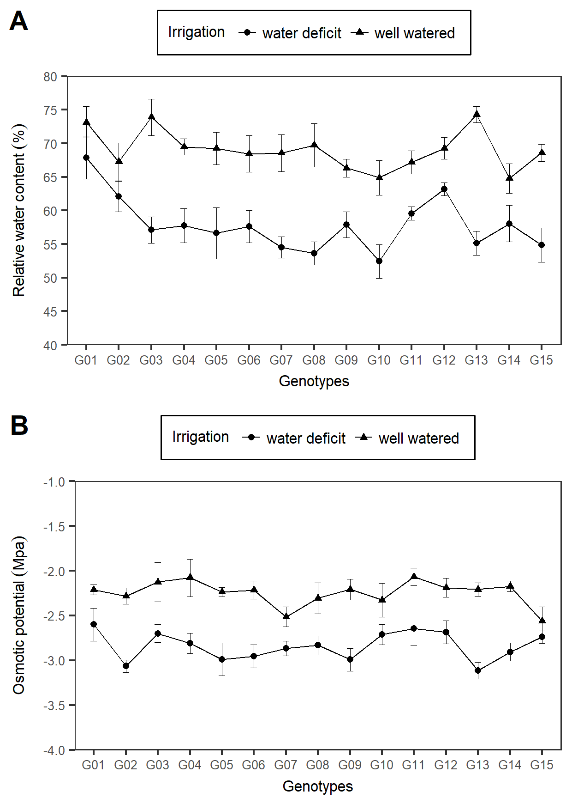
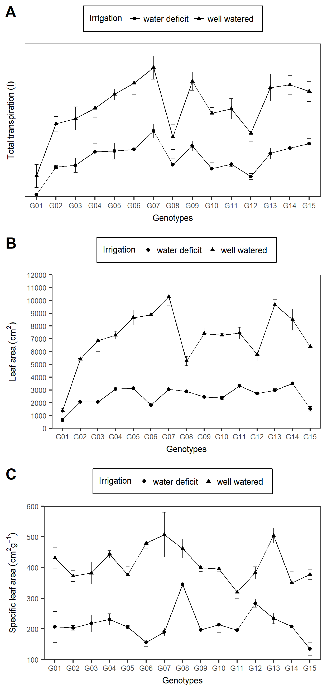
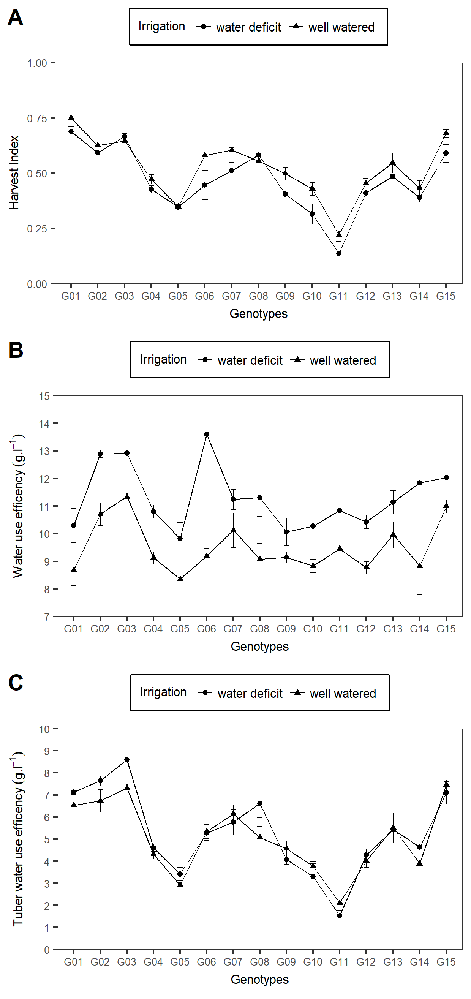
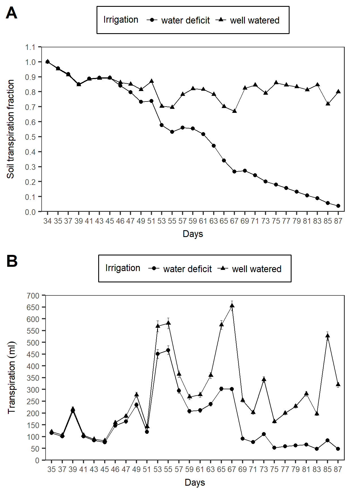

# Tables and figures

```{r data, echo=FALSE}

library(googlesheets)
library(tidyverse)
library(agricolae)
library(GerminaR)
library(FactoMineR)
library(gsheet)
library(cowplot)

gss <- gs_ls()
fb <- gs_url("https://docs.google.com/spreadsheets/d/1fu3y-z9v3RJTxvkIc4i1VwxQ0399V5CJQi_38ot4F4c/edit#gid=142311263") 


gnt <- fb %>% gs_read(ws = "Genotypes") %>% 
  select(Number, Genotypes, Adaptability, "Growning period" = GPL, "Heat tolerance" = Heat, "Dry matter (%)") %>% 
  mutate_all(funs(replace(., is.na(.), " ")))

dt <- fb %>% gs_read(ws = "FieldBook") %>%
  mutate(TREAT = ifelse(TREAT == "wellwater", "WW", "WD")) %>% 
  select(block = BLOCK,
         TREAT,
         GENOTYPE,
         SPAD_29 = SPAD.29DAP,
         SPAD_59 = SPAD.59DAP,
         SPAD_76 = SPAD.76DAP,
         SPAD_83 = SPAD.83DAP,
         HGT = HGT.86DAP,
         RWC = RWC.84DAP,
         LOP = OP.84DAP,
         LDW = LEAFDW,
         SDW = STEMDW,
         RDW = ROOTDW,
         TDW =TUBDW,
         NTUB,
         TRS = TTRNS,
         LFA = LA
         ) %>% 
  mutate(TDB = (LDW+SDW+RDW+TDW),
         HI = TDW/(LDW+SDW+RDW+TDW),
         SLA = LFA/LDW,
         WUE = (LDW+SDW+RDW+TDW)/TRS,
         TWUE = TDW/TRS
         ) %>% 
  mutate(GNT = recode(GENOTYPE, 
                      "CIP720088" = "G01",
                      "CIP392797.22" = "G02",
                      "CIP397077.16" = "G03",
                      "CIP398192.213" = "G04",
                      "CIP398180.612" = "G05",
                      "CIP398208.704" = "G06",
                      "CIP398098.119" = "G07",
                      "CIP398190.89" = "G08",
                      "CIP398192.592" = "G09",
                      "CIP398201.510" = "G10",
                      "CIP398203.244" = "G11",
                      "CIP398203.5" = "G12",
                      "CIP398208.219" = "G13",
                      "CIP398208.33" = "G14",
                      "CIP398208.620" = "G15"))
     
```

## Abbreviations

SPAD = Soil Plant Analysis Development \
HGT = Height \
RWC = Relative water content \
LOP = Leaf osmotic potential \
LDW = Leaf dry weight \
SDW = Stem dry weight \
RDW = Root dry weight \
TDW = Tuber dry weight \
NTUB = Tuber number \
TRS = Total transpiration \
LFA = Leaf area \
TDB = Total dry biomass \
HI = Harvest index \
SLA = Specif leaf area \
WUE = Water use efficiency \
TWUE = Tuber water use efficiency
         
## Tables

```{r}

knitr::kable(
  gnt,
  booktabs = TRUE,
  caption = "List of potato (*Solanum tuberosum* L.) genotypes from advanced breeding population at International Potato Center (CIP) used in the experiment."
  )

```


```{r}

dtei <- dt %>% 
  # filter(TREAT == "WD") %>% 
  as.data.frame()

eindx <- st4gi::elston(traits = c("TDW", "NTUB", "RDW", "LFA", "HI", "TWUE"), 
                       geno = "GENOTYPE", env = "TREAT", data = dtei) %>% 
  dplyr::arrange(E.Rank) %>% rename(Genotype = geno)

knitr::kable(
  eindx,
  booktabs = TRUE,
  caption = "The best genotypes ranking accroding Elston index for best tuber dry weight (TDW), tuber number (NTUB), root dry weight (RWD), leaf area (LFA), harvest index (HI), tuber water use efficency (TWUE). Ref: Elston, R. C. (1963). A weight-free index for the purpose of ranking or selection with respect to several traits at a time. Biometrics. 19(1): 85-97."
  )

```

## Figures

```{r, eval=FALSE, include=FALSE}

dtpca <- dt %>%
  select(-block, -GNT) %>% 
  group_by(TREAT, GENOTYPE) %>%
  summarise_all(funs(mean), na.rm = TRUE) %>% 
  mutate(coln = paste(GENOTYPE, TREAT,  sep = "_")) %>% 
  column_to_rownames("coln") %>% 
  select(-GENOTYPE)

pca <- PCA(dtpca, graph = F, scale.unit = TRUE, quali.sup = 1)

# Analalisis de componentes principales

ppi <- 300
png("img/Fig_01.png", width=8*ppi, height=8*ppi, res=ppi)

plot.PCA(pca,choix="var",
         title="Principal Component Analisys",
         autoLab = "y", cex = 0.8, shadowtext = T)

graphics.off()


ppi <- 300
png("img/Fig_02.png", width=8*ppi, height=8*ppi, res=ppi)

plot.PCA(pca,choix="ind", habillage = 1, col.hab=c("red","blue"), 
         title="Principal Component Analisys",
         autoLab = "y", cex = 0.7, shadowtext = T)

graphics.off()

# Resumen de resultados

#  summary(pca, nbelements = Inf)

# Correlacion de dimensiones

# dimdesc(pca)

# Analisis de Hierarchical Clustering 

ppi <- 300
png("img/Fig_03.png", width=8*ppi, height=8*ppi, res=ppi)

clus <- HCPC(pca, nb.clust=-1)

graphics.off()

```

```{r p1, fig.align='center', fig.cap="Principal components analysis (PCA) of the variables"}

knitr::include_graphics("img/Fig_01.png")

```

```{r p2, fig.align='center', fig.cap="Principal components analysis (PCA) of the individual"}

knitr::include_graphics("img/Fig_02.png")

```


```{r p3, fig.align='center', fig.cap="Hierarchical Clustering of the indiviudals"}

knitr::include_graphics("img/Fig_03.png")

```


```{r p4, fig.align='center', fig.cap="SPAD at 29 and 83 days after planting"}

# SPAD 29

av <- aov(SPAD_29 ~ GNT*TREAT + block, dt)
#summary(av)

mc <- GerminaR::ger_testcomp(aov = av, comp = c("GNT","TREAT"))

plt1 <- fplot(data = mc, type = "line", color = F,
             x = "GNT",
             y = "mean",
             z = "TREAT",
             ylab = "SPAD 29 DAP",
             xlab =  "Genotypes",
             lgl = "Irrigation",
             zbl = "water deficit  well watered",
             lgd = "top",
             erb =  T,
             lmt = c(40,70),
             brk = 5)


  # theme(axis.title.x=element_blank(),
  #       axis.text.x=element_blank(),
  #       axis.ticks.x=element_blank())


# SPAD 83

av <- aov(SPAD_83 ~ GNT*TREAT + block, dt)
#summary(av)

mc <- GerminaR::ger_testcomp(av, c("GNT","TREAT"))

plt2 <- fplot(data = mc, type = "line", color = F,
             x = "GNT",
             y = "mean",
             z = "TREAT",
             ylab = "SPAD 83 DAP",
             xlab =  "Genotypes",
             lgl = "Irrigation",
             zbl = "water deficit  well watered",
             lgd = "top",
             erb =  T,
             lmt = c(30,60),
             brk = 5)

  # theme(axis.title.x=element_blank(),
  #       axis.text.x=element_blank(),
  #       axis.ticks.x=element_blank())

plot <- plot_grid(plt1, plt2, labels = c("A", "B"), ncol = 1)

cowplot::ggsave("img/Fig_04.png", dpi= 300, width = 210*0.5 , height = 297*0.5, units = "mm")

knitr::include_graphics("img/Fig_04.png")

```


```{r p5, fig.align='center', fig.cap="Relative water content and osmotic potential"}

# RWC

av <- aov(RWC ~ GNT*TREAT + block, dt)
#summary(av)

mc <- GerminaR::ger_testcomp(av, c("GNT","TREAT"))

plt1 <- fplot(data = mc, type = "line", color = F,
             x = "GNT",
             y = "mean",
             z = "TREAT",
             ylab = "Relative water content ('%')",
             xlab =  "Genotypes",
             lgl = "Irrigation",
             zbl = "water deficit  well watered",
             lgd = "top",
             erb =  T,
             lmt = c(40,80),
             brk = 5)


  # theme(axis.title.x=element_blank(),
  #       axis.text.x=element_blank(),
  #       axis.ticks.x=element_blank())


# LOP

av <- aov(LOP ~ GNT*TREAT + block, dt)
#summary(av)

mc <- GerminaR::ger_testcomp(av, c("GNT","TREAT"))

plt2 <- fplot(data = mc, type = "line", color = F,
             x = "GNT",
             y = "mean",
             z = "TREAT",
             ylab = "Osmotic potential (Mpa)",
             xlab =  "Genotypes",
             lgl = "Irrigation",
             zbl = "water deficit  well watered",
             lgd = "top",
             lmt = c(-4,-1),
             brk = 0.5,
             erb =  T)


  # theme(axis.title.x=element_blank(),
  #       axis.text.x=element_blank(),
  #       axis.ticks.x=element_blank())

plot <- plot_grid(plt1, plt2, labels = c("A", "B"), ncol = 1)

cowplot::ggsave("img/Fig_05.png", dpi= 300, width = 210*0.5 , height = 297*0.5, units = "mm")



```

```{r p6, fig.align='center', fig.cap="Total transpiration, Leaf Area and Specific leaf Area"}

# TRS

av <- aov(TRS ~ GNT*TREAT + block, dt)
#summary(av)

mc <- GerminaR::ger_testcomp(av, c("GNT","TREAT"))

plt1 <- fplot(data = mc, type = "line", color = F,
             x = "GNT",
             y = "mean",
             z = "TREAT",
             ylab = "Total transpiration (l)",
             xlab =  "Genotypes",
             lgl = "Irrigation",
             zbl = "water deficit  well watered",
             lgd = "top",
             lmt = c(2,12),
             brk = 0,
             erb =  T)


  # theme(axis.title.x=element_blank(),
  #       axis.text.x=element_blank(),
  #       axis.ticks.x=element_blank())

# LFA

av <- aov(LFA ~ GNT*TREAT + block, dt)
#summary(av)

mc <- GerminaR::ger_testcomp(av, c("GNT","TREAT"))

plt2 <- fplot(data = mc, type = "line", color = F,
             x = "GNT",
             y = "mean",
             z = "TREAT",
             ylab = "Leaf area (cm^2)",
             xlab =  "Genotypes",
             lgl = "Irrigation",
             zbl = "water deficit  well watered",
             lgd = "top",
             lmt = c(0,12000),
             brk = 1000,
             erb =  T)


  # theme(axis.title.x=element_blank(),
  #       axis.text.x=element_blank(),
  #       axis.ticks.x=element_blank())


# SLA

av <- aov(SLA ~ GNT*TREAT + block, dt)
#summary(av)

mc <- GerminaR::ger_testcomp(av, c("GNT","TREAT"))

plt3 <- fplot(data = mc, type = "line", color = F,
             x = "GNT",
             y = "mean",
             z = "TREAT",
             ylab = "Specific leaf area (cm^2*g^{-1})",
             xlab =  "Genotypes",
             lgl = "Irrigation",
             zbl = "water deficit  well watered",
             lgd = "top",
             lmt = c(100,600),
             brk = 100,
             erb =  T)


  # theme(axis.title.x=element_blank(),
  #       axis.text.x=element_blank(),
  #       axis.ticks.x=element_blank())

plot <- plot_grid(plt1, plt2, plt3, labels = c("A", "B", "C"), ncol = 1)

cowplot::ggsave("img/Fig_06.png", dpi= 300, width = 210*0.5 , height = 297*0.75, units = "mm")



```


```{r p7, fig.align='center', fig.cap="Harvest Index, water use efficency, tuber wue"}

# HI

av <- aov(HI ~ GNT*TREAT + block, dt)
#summary(av)

mc <- GerminaR::ger_testcomp(av, c("GNT","TREAT"))

plt1 <- fplot(data = mc, type = "line", color = F,
             x = "GNT",
             y = "mean",
             z = "TREAT",
             ylab = "Harvest Index",
             xlab =  "Genotypes",
             lgl = "Irrigation",
             zbl = "water deficit  well watered",
             lgd = "top",
             lmt = c(0,1),
             # brk = 0.1,
             erb =  T)


  # theme(axis.title.x=element_blank(),
  #       axis.text.x=element_blank(),
  #       axis.ticks.x=element_blank())


# WUE

av <- aov(WUE ~ GNT*TREAT + block, dt)
#summary(av)

mc <- GerminaR::ger_testcomp(av, c("GNT","TREAT"))

plt2 <- fplot(data = mc, type = "line", color = F,
             x = "GNT",
             y = "mean",
             z = "TREAT",
             ylab = "Water use efficency (g.l^{-1})",
             xlab =  "Genotypes",
             lgl = "Irrigation",
             zbl = "water deficit  well watered",
             lgd = "top",
             lmt = c(7,15),
             brk = 1,
             erb =  T)


  # theme(axis.title.x=element_blank(),
  #       axis.text.x=element_blank(),
  #       axis.ticks.x=element_blank())

# TWUE

av <- aov(TWUE ~ GNT*TREAT + block, dt)
#summary(av)

mc <- GerminaR::ger_testcomp(av, c("GNT","TREAT"))

plt3 <- fplot(data = mc, type = "line", color = F,
             x = "GNT",
             y = "mean",
             z = "TREAT",
             ylab = "Tuber water use efficency (g.l^{-1})",
             xlab =  "Genotypes",
             lgl = "Irrigation",
             zbl = "water deficit  well watered",
             lgd = "top",
             lmt = c(0,10),
             brk = 1,
             erb =  T)


  # theme(axis.title.x=element_blank(),
  #       axis.text.x=element_blank(),
  #       axis.ticks.x=element_blank())

plot <- plot_grid(plt1, plt2, plt3, labels = c("A", "B", "C"), ncol = 1)

cowplot::ggsave("img/Fig_07.png", dpi= 300, width = 210*0.5 , height = 297*0.75, units = "mm")



```


```{r, fig.align='center', fig.cap="Soil transpiration fraction and transpiration during the experiment"}


fts <- fb %>% gs_read(ws = "FTSW") %>%
  filter(Treatment != "preharvest") %>% 
  tidyr::gather(key = day, value = fts, -ID, -Genotype, -Treatment)

av <- aov(fts ~ Treatment*day, fts)
mc <- GerminaR::ger_testcomp(av, c("Treatment", "day"))

plt1 <- fplot(data = mc, type = "line", color = F,
             x = "day",
             y = "mean",
             z = "Treatment",
             ylab = "Soil transpiration fraction",
             xlab =  "Days",
             lgl = "Irrigation",
             zbl = "water deficit  well watered",
             lgd = "top",
             lmt = c(0,1.1),
             brk = 0.1,
             erb =  T)


trns<- fb %>% gs_read(ws = "Transpiration") %>%
  filter(Treatment != "preharvest") %>% 
  tidyr::gather(key = day, value = trans, -ID, -Genotype, -Treatment) %>% 
  filter(day != "TOTAL") %>% 
  drop_na()

av <- aov(trans ~ Treatment*day, trns)
mc <- GerminaR::ger_testcomp(av, c("Treatment", "day"))

plt2 <- fplot(data = mc, type = "line", color = F,
             x = "day",
             y = "mean",
             z = "Treatment",
             ylab = "Transpiration (ml)",
             xlab =  "Days",
             lgl = "Irrigation",
             zbl = "water deficit  well watered",
             lgd = "top",
             lmt = c(0,700),
             brk = 50,
             erb =  T)

plot <- plot_grid(plt1, plt2, labels = c("A", "B"), ncol = 1)

cowplot::ggsave("img/Fig_08.png", dpi= 300, width = 210*0.5 , height = 297*0.5, units = "mm")




```


