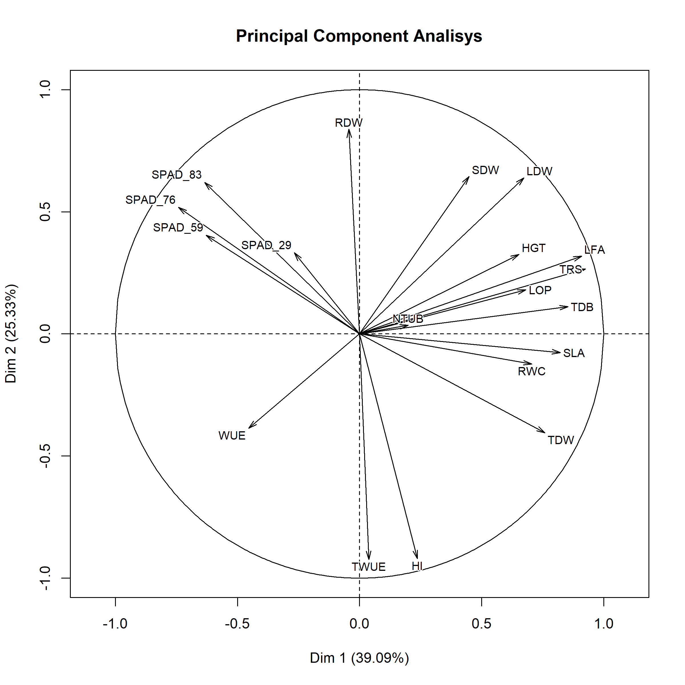
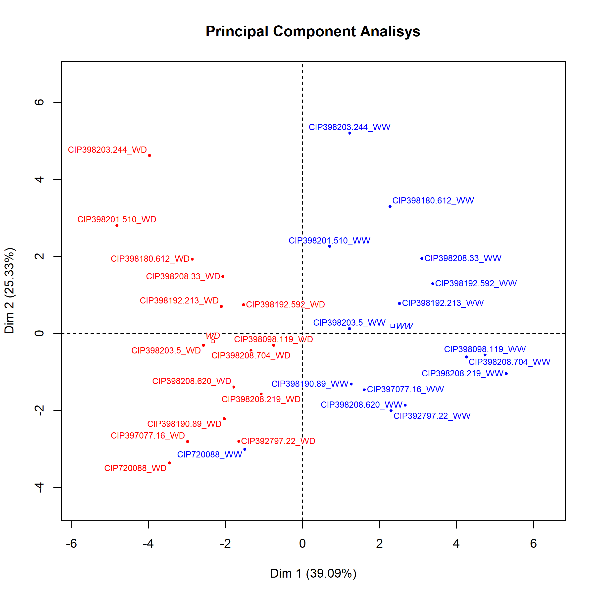
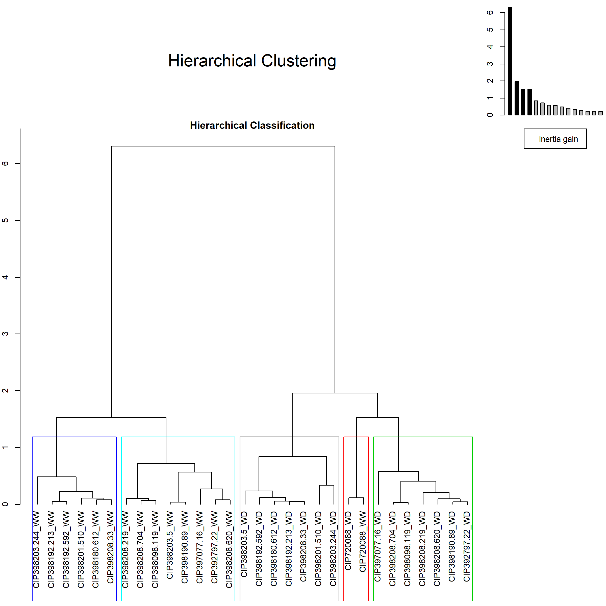
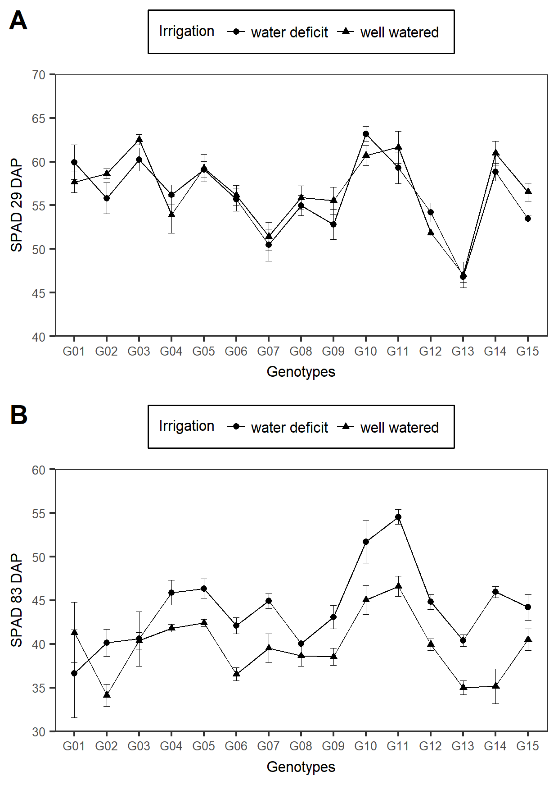

# Tables and figures

```{r data, echo=FALSE}

library(googlesheets)
library(tidyverse)
library(agricolae)
library(GerminaR)
library(FactoMineR)
library(gsheet)
library(cowplot)

gss <- gs_ls()
fb <- gs_url("https://docs.google.com/spreadsheets/d/1fu3y-z9v3RJTxvkIc4i1VwxQ0399V5CJQi_38ot4F4c/edit#gid=142311263") 


gnt <- fb %>% gs_read(ws = "Genotypes") %>% 
  select(Number, Genotypes, Adaptability, "Growning period" = GPL, "Heat tolerance" = Heat, "Dry matter (%)") %>% 
  mutate_all(funs(replace(., is.na(.), " ")))

dt <- fb %>% gs_read(ws = "FieldBook") %>%
  mutate(TREAT = ifelse(TREAT == "wellwater", "WW", "WD")) %>% 
  select(block = BLOCK,
         TREAT,
         GENOTYPE,
         SPAD_29 = SPAD.29DAP,
         SPAD_59 = SPAD.59DAP,
         SPAD_76 = SPAD.76DAP,
         SPAD_83 = SPAD.83DAP,
         HGT = HGT.86DAP,
         RWC = RWC.84DAP,
         LOP = OP.84DAP,
         LDW = LEAFDW,
         SDW = STEMDW,
         RDW = ROOTDW,
         TDW =TUBDW,
         NTUB,
         TRS = TTRNS,
         LFA = LA
         ) %>% 
  mutate(TDB = (LDW+SDW+RDW+TDW),
         HI = TDW/(LDW+SDW+RDW+TDW),
         SLA = LFA/LDW,
         WUE = (LDW+SDW+RDW+TDW)/TRS,
         TWUE = TDW/TRS
         ) %>% 
  mutate(GNT = recode(GENOTYPE, 
                      "CIP720088" = "G01",
                      "CIP392797.22" = "G02",
                      "CIP397077.16" = "G03",
                      "CIP398192.213" = "G04",
                      "CIP398180.612" = "G05",
                      "CIP398208.704" = "G06",
                      "CIP398098.119" = "G07",
                      "CIP398190.89" = "G08",
                      "CIP398192.592" = "G09",
                      "CIP398201.510" = "G10",
                      "CIP398203.244" = "G11",
                      "CIP398203.5" = "G12",
                      "CIP398208.219" = "G13",
                      "CIP398208.33" = "G14",
                      "CIP398208.620" = "G15"))
     
```


## Tables

```{r functions, echo=FALSE}

knitr::kable(
  gnt,
  booktabs = TRUE,
  caption = "List of potato (*Solanum tuberosum* L.) genotypes from advanced breeding population at International Potato Center (CIP) used in the experiment."
  )

```


## Figures

```{r, echo=FALSE, eval=FALSE}

dtpca <- dt %>%
  select(-block, -GNT) %>% 
  group_by(TREAT, GENOTYPE) %>%
  summarise_all(funs(mean), na.rm = TRUE) %>% 
  mutate(coln = paste(GENOTYPE, TREAT,  sep = "_")) %>% 
  column_to_rownames("coln") %>% 
  select(-GENOTYPE)

pca <- PCA(dtpca, graph = F, scale.unit = TRUE, quali.sup = 1)

# Analalisis de componentes principales

ppi <- 300
png("img/Fig_01.png", width=8*ppi, height=8*ppi, res=ppi)

plot.PCA(pca,choix="var",
         title="Principal Component Analisys",
         autoLab = "y", cex = 0.8, shadowtext = T)

graphics.off()


ppi <- 300
png("img/Fig_02.png", width=8*ppi, height=8*ppi, res=ppi)

plot.PCA(pca,choix="ind", habillage = 1, col.hab=c("red","blue"),
         title="Principal Component Analisys",
         autoLab = "y", cex = 0.7, shadowtext = T)

graphics.off()

# Resumen de resultados

#  summary(pca, nbelements = Inf)

# Correlacion de dimensiones

# dimdesc(pca)

# Analisis de Hierarchical Clustering 

ppi <- 300
png("img/Fig_03.png", width=8*ppi, height=8*ppi, res=ppi)

clus <- HCPC(pca, nb.clust=-1)

graphics.off()


```

```{r, fig.align='center', fig.cap="Principal components analysis (PCA) of the variables evaluated in fifteen potato genotypes under dorught stress condition"}



```

```{r, fig.align='center', fig.cap="Principal components analysis (PCA) of the individuals evaluated in fifteen potato genotypes under dorught stress condition"}



```

```{r, fig.align='center', fig.cap="Hierarchical Clustering of the indiviudals evaluated in fifteen potato genotypes under dorught stress condition"}



```

```{r, echo=FALSE, fig.align='center'}

# SPAD 29

av <- aov(SPAD_29 ~ GNT*TREAT + block, dt)
#summary(av)

mc <- GerminaR::ger_testcomp(av, c("GNT","TREAT"))

plt <- fplot(data = mc, type = "line", color = F,
             x = "GNT", 
             y = "mean",
             z = "TREAT", 
             ylab = "SPAD 29 DAP",
             xlab =  "Genotypes",
             lgl = "Irrigation treatment",
             zbl = "water deficit  well watered",
             lgd = "top",
             erb =  T,
             lmt = c(40,70),
             brk = 5)


  # theme(axis.title.x=element_blank(),
  #       axis.text.x=element_blank(),
  #       axis.ticks.x=element_blank())

cowplot::ggsave("img/Fig_04.png", dpi= 300, width = 210*0.5 , height = 297*0.25, units = "mm")



```


```{r, fig.align='center', fig.cap="Effect of water deficit on (a) biomass production (kgDW.m-2) and drought susceptibility index (TDWS, defined as tuber dry weight per square meter expressed relative to control treatment) in two commercial varieties and thirteen advanced potato genotypes, and (b) Fraction of transpirable soil water (FTSW) from the beginning of water deficit treatment. Data are the means ±SE (standard error) of 5 replicates. White and black bars represent WW= well-watered and WD= water deficit treatments."}

# knitr::include_graphics("img/Fig_0.png")


```


```{r, fig.align='center', fig.cap= "Effect of water deficit on (a) tuber yield (kg/m2), (b) harvest index (HI), defined as tuber dry weight per total biomass), and (c) specific leaf area (SLA) in two commercial varieties and thirteen advanced potato genotypes. Data are the means ±SE (standard error) of five replicates. White and black bars represent WW= well-watered and WD= water deficit treatments."}


# knitr::include_graphics("img/Fig_0.png")

```


```{r, fig.align='center', fig.cap= "Water use efficiency (WUE) of total biomass (g.L-1) (a) and the weighted average of the WUE of each of the plant organs (g.L-1) (b) in two commercial varieties and thirteen advanced potato genotypes. Data are the means ±SE (standard error) of five replicates for tuber, leaf, stem and root in well-watered (WW) and water deficit (WD) treatments."}

# knitr::include_graphics("img/Fig_0.png")

```


```{r, fig.align='center', fig.cap= "Relationship between (a) total transpiration and total biomass, (b) tuber yield and water use efficiency (WUE), and between (c) Harvest index and TDWS in 2 commercial varieties and thirteen advanced potato genotypes. Solid line circle depicts tolerant genotypes, dashed line circle the medium tolerant ones, and the dotted line circle the sensitive genotypes. Data are the means ±SE (standard error) of five replicates."}

# knitr::include_graphics("img/Fig_0.png")

```


```{r, fig.align='center', fig.cap= "Means ± SE (standard error) of root:shoot ratio, chlorophyll content (SPAD), relative water content (RWC), and osmotic potential (MPa) in two commercial varieties and thirteen advanced potato genotypes. Data are the means of five replicates. WW= well-watered and WD= water deficit treatments."}

# knitr::include_graphics("img/Fig_0.png")

```


