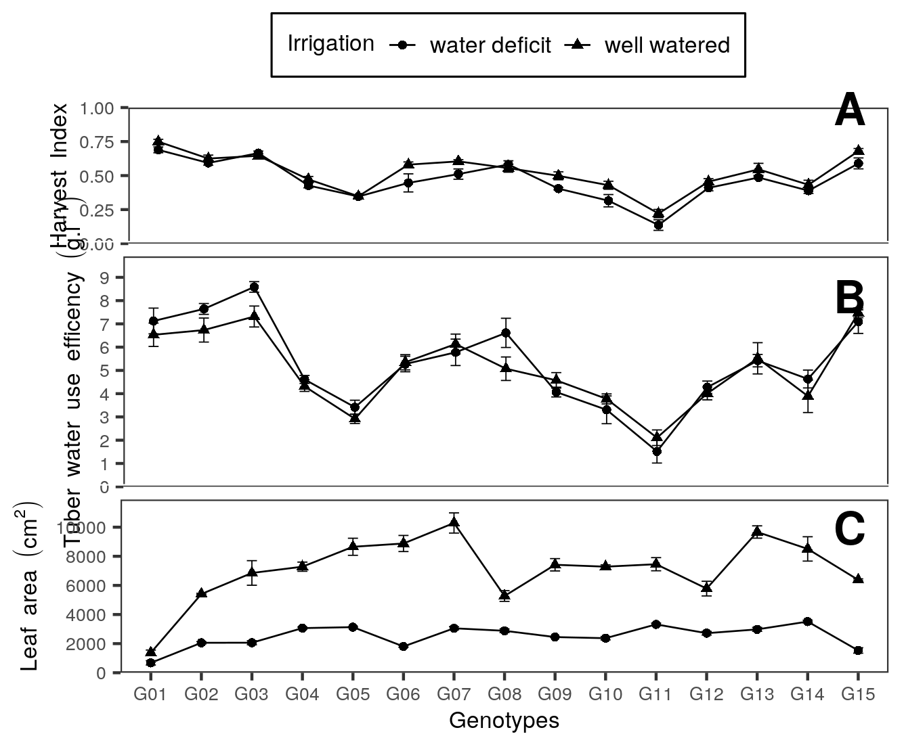

```{r import, include=FALSE}
# source("cnfg/debug.r")
source("cnfg/setup.r")
sheets_auth(T)
url <- "https://docs.google.com/spreadsheets/d/1dfgpmCKdPmxRHozrZp0iE_xMGsvKTIcztDpMWYSEGaY/edit#gid=142311263"
gs <- as_sheets_id(url)
# browseURL(url)
xl <- gs %>% drive_download("files/fieldbook.xlsx", overwrite = T) %>% pluck(2)

fb <- xl %>% 
  readxl::read_excel("fb") %>% 
  select_all("tolower") %>% 
  select_all(~gsub("\\s+|\\.", "_", .)) %>% 
  mutate(treat = ifelse(treat == "wellwater", "WW", "WD")) %>% 
  select(block, treat, genotype, 
         spad_29 = spad_29dap, 
         spad_59 = spad_59dap, 
         spad_76 = spad_76dap, 
         spad_83 = spad_83dap,
         hgt = hgt_86dap,
         rwc = rwc_84dap,
         lop = op_84dap,
         ldw = leafdw,
         sdw = stemdw,
         rdw = rootdw,
         tdw = tubdw,
         ntub,
         trs = ttrns,
         lfa = la,
         rdl = rlg) %>% 
  mutate(tdb = (ldw+sdw+rdw+tdw),
         hi = tdw/(ldw+sdw+rdw+tdw),
         sla = lfa/ldw,
         wue = (ldw+sdw+rdw+tdw)/trs,
         twue = tdw/trs
         ) %>% 
  mutate(gnt = recode(genotype, 
                      "CIP720088" = "G01",
                      "CIP392797.22" = "G02",
                      "CIP397077.16" = "G03",
                      "CIP398192.213" = "G04",
                      "CIP398180.612" = "G05",
                      "CIP398208.704" = "G06",
                      "CIP398098.119" = "G07",
                      "CIP398190.89" = "G08",
                      "CIP398192.592" = "G09",
                      "CIP398201.510" = "G10",
                      "CIP398203.244" = "G11",
                      "CIP398203.5" = "G12",
                      "CIP398208.219" = "G13",
                      "CIP398208.33" = "G14",
                      "CIP398208.620" = "G15")) %>% 
  select(genotype, gnt, treat, block, everything()) %>% 
  mutate_if(is.character, as.factor)

```

# Tables {-}

```{r abrv}

gs %>% 
  sheets_read(sheet = "var") %>% 
  filter(include == "x") %>% 
  select(Variable, Abbreviation) %>% 
  kable(caption = "List of abbreviations")

```

```{r gnt}

gs %>% 
  sheets_read("gnt") %>% 
  dplyr::select(Number, Genotypes, Adaptability, "Growning period" = GPL, "Heat tolerance" = Heat, "Dry matter (%)") %>% 
  kable(caption = "Potatos (*Solanum tuberosum* L.) genotypes used for water deficit experiment with  13 lines from advanced breeding population at International Potato Center (CIP) and two comercial varieties.")

```

```{r rnk, eval=FALSE, include=FALSE}

rnk <- fb %>%
  filter(treat == "WD") %>%
  as.data.frame() %>% 
  st4gi::elston(traits = c("tdw", "ntub", "rwd", "lfa", "hi", "twue"),
                       geno = "genotype", env = "treat", dfr = .) %>%
  dplyr::arrange(E.Rank) %>% 
  rename(Genotype = geno)

rnk %>% 
  kable(caption = "The best genotypes ranking accroding Elston index for best tuber dry weight (TDW), tuber number (NTUB), root dry weight (RWD), leaf area (LFA), harvest index (HI), tuber water use efficency (TWUE). Ref: Elston, R. C. (1963). A weight-free index for the purpose of ranking or selection with respect to several traits at a time. Biometrics. 19(1): 85-97.")

```

# Figures {-}

```{r srl, fig.cap= "Soil transpiration fraction and transpiration during the experiment"}

fts <- gs %>%
  sheets_read("ftsw") %>%
  filter(Treatment != "preharvest") %>%
  tidyr::gather(key = day, value = fts, -ID, -Genotype, -Treatment)

av <- aov(fts ~ Treatment*day, fts)
mc <- GerminaR::ger_testcomp(av, c("Treatment", "day"))

plt1 <- fplot(data = mc, type = "line", color = F,
             x = "day",
             y = "mean",
             z = "Treatment",
             ylab = "Soil transpiration fraction",
             xlab =  "Days",
             lgl = "Irrigation",
             zbl = "water deficit  well watered",
             lgd = "top",
             lmt = c(0,1.1),
             brk = 0.1,
             erb =  T) +

  theme(axis.title.x=element_blank(),
        axis.text.x=element_blank(),
        axis.ticks.x=element_blank())

trns <- gs %>% 
  sheets_read( "trans") %>%
  filter(Treatment != "preharvest") %>%
  tidyr::gather(key = day, value = trans, -ID, -Genotype, -Treatment) %>%
  filter(day != "TOTAL") %>%
  drop_na()

av <- aov(trans ~ Treatment*day, trns)
mc <- GerminaR::ger_testcomp(av, c("Treatment", "day"))

plt2 <- fplot(data = mc, type = "line", color = F,
             x = "day",
             y = "mean",
             z = "Treatment",
             ylab = "Transpiration (ml)",
             xlab =  "Days",
             lgl = "Irrigation",
             zbl = "water deficit  well watered",
             lgd = "none",
             lmt = c(0,790),
             brk = 100,
             erb =  T)

plot <- ggdraw(xlim = c(0, 0.5), ylim = c(0, 0.5))+
  draw_plot(plt1,  width = 0.494, height = 0.25, x = 0.0055, y = 0.234) +
  draw_plot(plt2,  width = 0.5, height = 0.25, x = 0.0, y = 0.0) +
          draw_plot_label(
            label = c("A", "B"),
            x = c(0.45, 0.45),
            y = c(0.43, 0.23))

save_plot(plot = plot, base_asp = 1.0, "files/fig_trans.png")
include_graphics("files/fig_trans.png")

```

```{r mlt, fig.align='center', fig.cap="Principal component analysis"}

mvd <- fb %>%
  select(-block, -gnt) %>%
  group_by(treat, genotype) %>%
  summarise_all(funs(mean), na.rm = TRUE) %>%
  mutate(coln = paste(genotype, treat,  sep = "_")) %>%
  column_to_rownames("coln") %>%
  select(-genotype)

pca <- PCA(mvd, graph = F, scale.unit = TRUE, quali.sup = 1)

# PCA

ppi <- 300
png("files/pca_var.png", width=8*ppi, height=8*ppi, res=ppi)

plot.PCA(pca,choix="var",
         title="",
         autoLab = "y", 
         cex = 0.8, 
         shadowtext = T)

graphics.off()


ppi <- 300
png("files/pca_ind.png", width=8*ppi, height=8*ppi, res=ppi)

plot.PCA(pca,choix="ind", habillage = 1, col.hab=c("red","blue"),
         title="",
         autoLab = "y", cex = 0.7, shadowtext = T)

graphics.off()

# Results

# summary(pca, nbelements = Inf)

# Correlation de dimensiones

# dimdesc(pca)

# Analysis de Hierarchical Clustering

ppi <- 300
png("files/pca_clu.png", width=8*ppi, height=8*ppi, res=ppi)

clus <- HCPC(pca, nb.clust=-1)

graphics.off()

pcv <- png::readPNG("files/pca_var.png") %>%
  grid::rasterGrob(interpolate = TRUE)

pcc <- png::readPNG("files/pca_clu.png") %>%
  grid::rasterGrob(interpolate = TRUE)

plot <- ggdraw(xlim = c(0.05, 0.8), ylim = c(0, 0.5))+
  draw_plot(pcv,  width = 0.5, height = 0.5, x = 0.0, y = 0.0) +
  draw_plot(pcc,  width = 0.5, height = 0.5, x = 0.35, y = 0.0) +
          draw_plot_label(
            label = c("A", "B"),
            x = c(0.37, 0.723),
            y = c(0.45, 0.45))

save_plot(plot = plot, base_asp = 2.15, "files/fig_mv.png")
include_graphics("files/fig_mv.png")

```


```{r cor, fig.cap="Correlation analysis"}
cr <- fb %>% 
  group_by(gnt, treat) %>% 
  summarise_all(list(mean), na.rm = TRUE) %>% 
  as.data.frame() %>% 
  select(-c( genotype, block)) %>% 
  unite(gnt, treat, col = "rn") %>% 
  column_to_rownames("rn") 

cg <- heatmaply_cor(
  cor(cr),
  k_col = 5, 
  dendrogram = c("column"),
  grid_gap = 1,
  cellnote = cor(cr)
      )
plotly::orca(p = cg, file = "files/fig_corr.png")

```


```{r var, fig.cap="Harvest Index, tuber water use efficency"}

# HI
av <- aov(hi ~ gnt*treat + block, fb)
#summary(av)

mc <- GerminaR::ger_testcomp(av, c("gnt","treat"))

plt1 <- fplot(data = mc, type = "line", color = F,
             x = "gnt",
             y = "mean",
             z = "treat",
             ylab = "Harvest Index",
             xlab =  "Genotypes",
             lgl = "Irrigation",
             zbl = "water deficit  well watered",
             lgd = "top",
             lmt = c(0, 1),
             erb =  T) +

  theme(axis.title.x=element_blank(),
        axis.text.x=element_blank(),
        axis.ticks.x=element_blank())


# TWUE

av <- aov(twue ~ gnt*treat + block, fb)
#summary(av)

mc <- GerminaR::ger_testcomp(av, c("gnt","treat"))

plt2 <- fplot(data = mc, type = "line", color = F,
             x = "gnt",
             y = "mean",
             z = "treat",
             ylab = "Tuber water use efficency (g.l^{-1})",
             xlab =  "Genotypes",
             lgl = "Irrigation",
             zbl = "water deficit  well watered",
             lgd = "none",
             lmt = c(0,9.9),
             brk = 1,
             erb =  T) +

  theme(axis.title.x=element_blank(),
        axis.text.x=element_blank(),
        axis.ticks.x=element_blank())


# LFA

av <- aov(lfa ~ gnt*treat+ block, fb)
#summary(av)

mc <- GerminaR::ger_testcomp(av, c("gnt","treat"))

plt3 <- fplot(data = mc, type = "line", color = F,
             x = "gnt",
             y = "mean",
             z = "treat",
             ylab = "Leaf area (cm^2)",
             xlab =  "Genotypes",
             lgl = "Irrigation",
             zbl = "water deficit  well watered",
             lgd = "none",
             lmt = c(0,11900),
             brk = 2000,
             erb =  T)


plot <- ggdraw(xlim = c(-0.02, 0.5), ylim = c(0, 0.7))+
  draw_plot(plt1,  width = 0.5, height = 0.25, x = 0.0, y = 0.452) +
  draw_plot(plt2,  width = 0.497, height = 0.25, x = 0.003, y = 0.226) +
  draw_plot(plt3,  width = 0.522, height = 0.25, x = -0.022, y = 0.0) +
          draw_plot_label(
            label = c("A", "B", "C"),
            x = c(0.45, 0.45, 0.45),
            y = c(0.63, 0.455, 0.24))


save_plot(plot = plot, base_asp = 1.2, "files/fig_ylc.png")


```


```{r p4, fig.align='center', fig.cap="SPAD at 29 and 83 days after planting"}

# WUE

av <- aov(wue ~ gnt*treat + block, fb)
#summary(av)

mc <- GerminaR::ger_testcomp(av, c("gnt","treat"))

plt2 <- fplot(data = mc, type = "line", color = F,
             x = "gnt",
             y = "mean",
             z = "treat",
             ylab = "Water use efficency (g.l^{-1})",
             xlab =  "Genotypes",
             lgl = "Irrigation",
             zbl = "water deficit  well watered",
             lgd = "top",
             lmt = c(7,15),
             brk = 1,
             erb =  T)


  # theme(axis.title.x=element_blank(),
  #       axis.text.x=element_blank(),
  #       axis.ticks.x=element_blank())


# SPAD 29

av <- aov(spad_29 ~ gnt*treat + block, fb)
#summary(av)

mc <- GerminaR::ger_testcomp(aov = av, comp = c("gnt","treat"))

plt1 <- fplot(data = mc, type = "line", color = F,
             x = "gnt",
             y = "mean",
             z = "treat",
             ylab = "SPAD 29 DAP",
             xlab =  "Genotypes",
             lgl = "Irrigation",
             zbl = "water deficit  well watered",
             lgd = "top",
             erb =  T,
             lmt = c(40,70),
             brk = 5)


  # theme(axis.title.x=element_blank(),
  #       axis.text.x=element_blank(),
  #       axis.ticks.x=element_blank())


# SPAD 83

av <- aov(spad_83 ~ gnt*treat + block, fb)
#summary(av)

mc <- GerminaR::ger_testcomp(aov = av, comp = c("gnt","treat"))

plt2 <- fplot(data = mc, type = "line", color = F,
             x = "gnt",
             y = "mean",
             z = "treat",
             ylab = "SPAD 83 DAP",
             xlab =  "Genotypes",
             lgl = "Irrigation",
             zbl = "water deficit  well watered",
             lgd = "top",
             erb =  T,
             lmt = c(30,60),
             brk = 5)

  # theme(axis.title.x=element_blank(),
  #       axis.text.x=element_blank(),
  #       axis.ticks.x=element_blank())

# RWC

av <- aov(rwc ~ gnt*treat + block, fb)
#summary(av)

mc <- GerminaR::ger_testcomp(av, c("gnt","treat"))

plt1 <- fplot(data = mc, type = "line", color = F,
             x = "gnt",
             y = "mean",
             z = "treat",
             ylab = "Relative water content ('%')",
             xlab =  "Genotypes",
             lgl = "Irrigation",
             zbl = "water deficit  well watered",
             lgd = "top",
             erb =  T,
             lmt = c(40,80),
             brk = 5)


  # theme(axis.title.x=element_blank(),
  #       axis.text.x=element_blank(),
  #       axis.ticks.x=element_blank())


# LOP

av <- aov(lop ~ gnt*treat+ block, fb)
#summary(av)

mc <- GerminaR::ger_testcomp(av, c("gnt","treat"))

plt2 <- fplot(data = mc, type = "line", color = F,
             x = "gnt",
             y = "mean",
             z = "treat",
             ylab = "Osmotic potential (Mpa)",
             xlab =  "Genotypes",
             lgl = "Irrigation",
             zbl = "water deficit  well watered",
             lgd = "top",
             lmt = c(-4,-1),
             brk = 0.5,
             erb =  T)


  # theme(axis.title.x=element_blank(),
  #       axis.text.x=element_blank(),
  #       axis.ticks.x=element_blank())


# TRS

av <- aov(trs ~ gnt*treat + block, fb)
#summary(av)

mc <- GerminaR::ger_testcomp(av, c("gnt","treat"))

plt1 <- fplot(data = mc, type = "line", color = F,
             x = "gnt",
             y = "mean",
             z = "treat",
             ylab = "Total transpiration (l)",
             xlab =  "Genotypes",
             lgl = "Irrigation",
             zbl = "water deficit  well watered",
             lgd = "top",
             lmt = c(2,12),
             brk = 0,
             erb =  T)


  # theme(axis.title.x=element_blank(),
  #       axis.text.x=element_blank(),
  #       axis.ticks.x=element_blank())


  # theme(axis.title.x=element_blank(),
  #       axis.text.x=element_blank(),
  #       axis.ticks.x=element_blank())


# SLA

av <- aov(sla ~ gnt*treat+ block, fb)
#summary(av)

mc <- GerminaR::ger_testcomp(av, c("gnt","treat"))

plt3 <- fplot(data = mc, type = "line", color = F,
             x = "gnt",
             y = "mean",
             z = "treat",
             ylab = "Specific leaf area (cm^2*g^{-1})",
             xlab =  "Genotypes",
             lgl = "Irrigation",
             zbl = "water deficit  well watered",
             lgd = "top",
             lmt = c(100,600),
             brk = 100,
             erb =  T)


  # theme(axis.title.x=element_blank(),
  #       axis.text.x=element_blank(),
  #       axis.ticks.x=element_blank())

```
