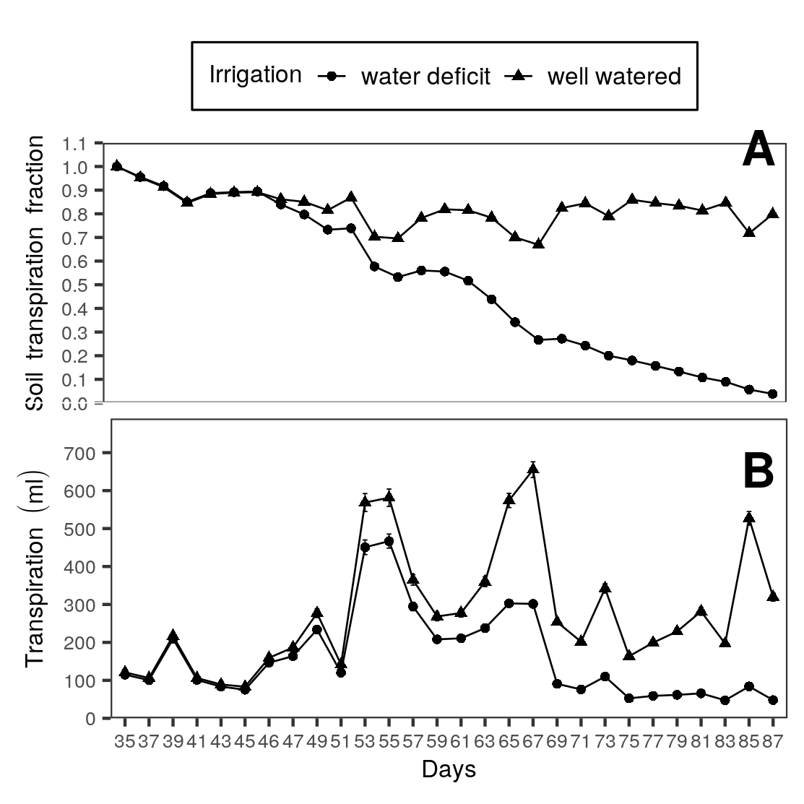
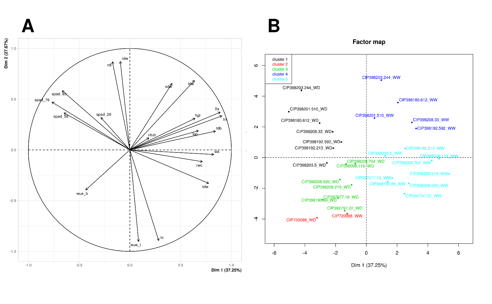

```{r import, include=FALSE}
# source("cnfg/debug.r")
source("cnfg/setup.r")
url <- "https://docs.google.com/spreadsheets/d/1dfgpmCKdPmxRHozrZp0iE_xMGsvKTIcztDpMWYSEGaY/edit#gid=142311263"
gs <- as_sheets_id(url)
# browseURL(url)
xl <- gs %>% drive_download("files/fieldbook.xlsx", overwrite = T) %>% pluck(2)

fb <- xl %>% 
  readxl::read_excel("fb") %>% 
  select_all("tolower") %>%
  select_all(~gsub("\\s+|\\.", "_", .)) %>% 
  mutate(treat = ifelse(treat == "wellwater", "WW", "WD")) %>% 
  select(block, treat, genotype,
         spad_29 = spad_29dap, 
         spad_59 = spad_59dap, 
         spad_76 = spad_76dap, 
         spad_83 = spad_83dap,
         hgt = hgt_86dap,
         rwc = rwc_84dap,
         lop = op_84dap,
         ldw = leafdw,
         sdw = stemdw,
         rdw = rootdw,
         tdw = tubdw,
         ntub,
         trs = ttrns,
         lfa = la,
         rdl = rlg) %>% 
  mutate(tdb = (ldw+sdw+rdw+tdw),
         hi = tdw/(ldw+sdw+rdw+tdw),
         sla = lfa/ldw,
         wue = (ldw+sdw+rdw+tdw)/trs,
         twue = tdw/trs
         ) %>% 
  mutate(gnt = recode(genotype, 
                      "CIP720088" = "G01",
                      "CIP392797.22" = "G02",
                      "CIP397077.16" = "G03",
                      "CIP398192.213" = "G04",
                      "CIP398180.612" = "G05",
                      "CIP398208.704" = "G06",
                      "CIP398098.119" = "G07",
                      "CIP398190.89" = "G08",
                      "CIP398192.592" = "G09",
                      "CIP398201.510" = "G10",
                      "CIP398203.244" = "G11",
                      "CIP398203.5" = "G12",
                      "CIP398208.219" = "G13",
                      "CIP398208.33" = "G14",
                      "CIP398208.620" = "G15")) %>% 
  select(genotype, gnt, treat, block, everything()) %>% 
  mutate_if(is.character, as.factor)

```

# Tables {-}

```{r abrv}

xl %>% 
  readxl::read_excel(sheet = "var") %>% 
  filter(include == "x") %>% 
  select(Variable, Abbreviation) %>% 
  mutate_at("Abbreviation", "tolower") %>% 
  kable(caption = "List of abbreviations")

```

```{r gnt}

xl %>% 
  readxl::read_excel("gnt") %>% 
  dplyr::select(Number, Genotypes, Adaptability, "Growning period" = GPL, "Heat tolerance" = Heat, "Dry matter (%)") %>% 
  kable(caption = "Potatos (*Solanum tuberosum* L.) genotypes used for water deficit experiment with  13 lines from advanced breeding population at International Potato Center (CIP) and two comercial varieties.")

```

```{r svt}

fb %>%
  select(-block, -gnt, -genotype) %>% 
  tbl_summary(
    by = treat, 
    statistic = list(all_continuous() ~ "{mean} ± {sd}"),
    missing = "no") %>% 
  add_p() %>% 
  bold_labels() %>% 
  as_tibble() %>% 
  knitr::kable(caption = "List of variables measured in 15 potato genotypes under well-watered (WW) and water deficit (WD) treatment. Where: Tuber dry weight (TDW), tuber number (NTUB), root dry weight (RWD), leaf area (LFA), harvest index (HI), tuber water use efficency (TWUE).")

```

# Figures {-}

```{r srl, fig.cap= "Soil transpiration fraction and transpiration during the experiment"}

fts <- xl %>% 
  readxl::read_excel("ftsw") %>%
  filter(Treatment != "preharvest") %>%
  tidyr::gather(key = day, value = fts, -ID, -Genotype, -Treatment)

av <- aov(fts ~ Treatment*day, fts)
mc <- GerminaR::ger_testcomp(av, c("Treatment", "day"))

plt1 <- fplot(data = mc, type = "line", color = F,
             x = "day",
             y = "mean",
             z = "Treatment",
             ylab = "Soil transpiration fraction",
             xlab =  "Days",
             lgl = "Irrigation",
             zbl = "water deficit  well watered",
             lgd = "top",
             lmt = c(0,1.1),
             brk = 0.1,
             erb =  T) +
  theme(axis.title.x=element_blank(),
        axis.text.x=element_blank(),
        axis.ticks.x=element_blank())

trns <- xl %>% 
  readxl::read_excel("trans") %>%
  filter(Treatment != "preharvest") %>%
  tidyr::gather(key = day, value = trans, -ID, -Genotype, -Treatment) %>%
  filter(day != "TOTAL") %>%
  drop_na()

av <- aov(trans ~ Treatment*day, trns)
mc <- GerminaR::ger_testcomp(av, c("Treatment", "day")) %>% 
  mutate_at("day", as.numeric)

plt2 <- fplot(data = mc, type = "line", color = F,
             x = "day",
             y = "mean",
             z = "Treatment",
             ylab = "Transpiration (ml)",
             xlab =  "Days",
             lgl = "Irrigation",
             zbl = "water deficit  well watered",
             lgd = "none",
             lmt = c(0,790),
             brk = 100,
             erb =  T)

plot <- ggdraw(xlim = c(0, 0.5), ylim = c(0,0.8))+
  draw_plot(plt1,  width = 0.494, height = 0.43, x = 0.00555, y = 0.362) +
  draw_plot(plt2,  width = 0.5, height = 0.4, x = 0.0, y = 0.0) +
          draw_plot_label(
            label = c("A", "B"),
            x = c(0.47, 0.47),
            y = c(0.68, 0.38))

save_plot(plot = plot, "files/fig_trans.png")


```

```{r mlt, fig.align='center', fig.cap="Principal component analysis"}

mvd <- fb %>%
  select(-block, -gnt) %>%
  group_by(treat, genotype) %>%
  summarise_all(funs(mean), na.rm = TRUE) %>%
  mutate(coln = paste(genotype, treat,  sep = "_")) %>%
  column_to_rownames("coln") %>%
  select(-genotype)

pca <- PCA(mvd, graph = F, scale.unit = TRUE, quali.sup = 1)

# PCA

ppi <- 300
png("files/pca_var.png", width=8*ppi, height=8*ppi, res=ppi)
plot.PCA(pca,choix="var",
         title="",
         autoLab = "y", 
         cex = 0.8, 
         shadowtext = T)
graphics.off()


ppi <- 300
png("files/pca_ind.png", width=8*ppi, height=8*ppi, res=ppi)

plot.PCA(pca,choix="ind", habillage = 1, col.hab=c("red","blue"),
         title="",
         autoLab = "y", cex = 0.7, shadowtext = T)

graphics.off()

# Results
# summary(pca, nbelements = Inf)

# Correlation de dimensiones
# dimdesc(pca)

# Analysis de Hierarchical Clustering

ppi <- 300
png("files/pca_clu.png", width=8*ppi, height=8*ppi, res=ppi)
clus <- HCPC(pca, nb.clust=-1)
graphics.off()

# clt$call$t$tree
# clt$desc.ind
# clt$desc.var

pcv <- png::readPNG("files/pca_var.png") %>%
  grid::rasterGrob(interpolate = TRUE)

pcc <- png::readPNG("files/pca_clu.png") %>%
  grid::rasterGrob(interpolate = TRUE)

plot <- ggdraw(xlim = c(0.0, 1.0), ylim = c(0, 0.5))+
  draw_plot(pcv,  width = 0.5, height = 0.5, x = 0.0, y = 0.0) +
  draw_plot(pcc,  width = 0.5, height = 0.5, x = 0.5, y = 0.0) +
          draw_plot_label(
            label = c("A", "B"),
            x = c(0.03, 0.53),
            y = c(0.48, 0.48))

save_plot(plot = plot, "files/fig_mv.png")


```

```{r cor, fig.cap="Correlation analysis"}

cr <- fb %>% 
  group_by(gnt, treat) %>% 
  summarise_all(list(mean), na.rm = TRUE) %>% 
  as.data.frame() %>% 
  select(-c( genotype, block)) %>% 
  unite(gnt, treat, col = "rn") %>% 
  column_to_rownames("rn") 

cp <- heatmaply_cor(
  cor(cr),
  k_col = 5, 
  dendrogram = c("column"),
  grid_gap = 1,
  cellnote = round(cor(cr),2),
  cellnote_textposition = "middle center",
  cellnote_size = 10
)

# plotly::orca(p = cp, file = "files/fig_cor.png")

include_graphics("files/fig_cor.png")

```


