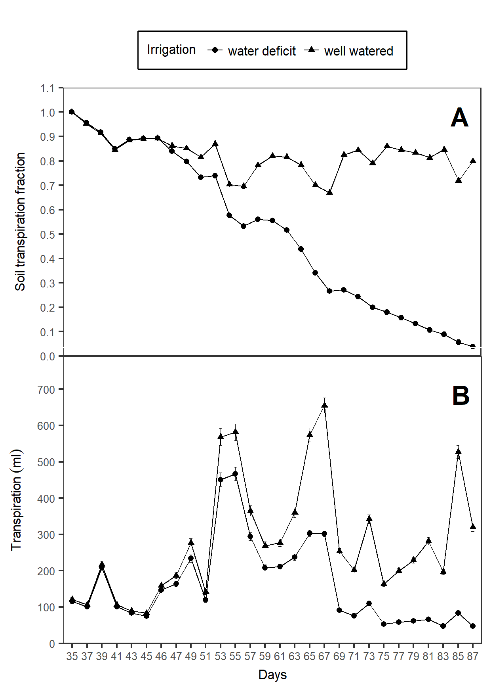
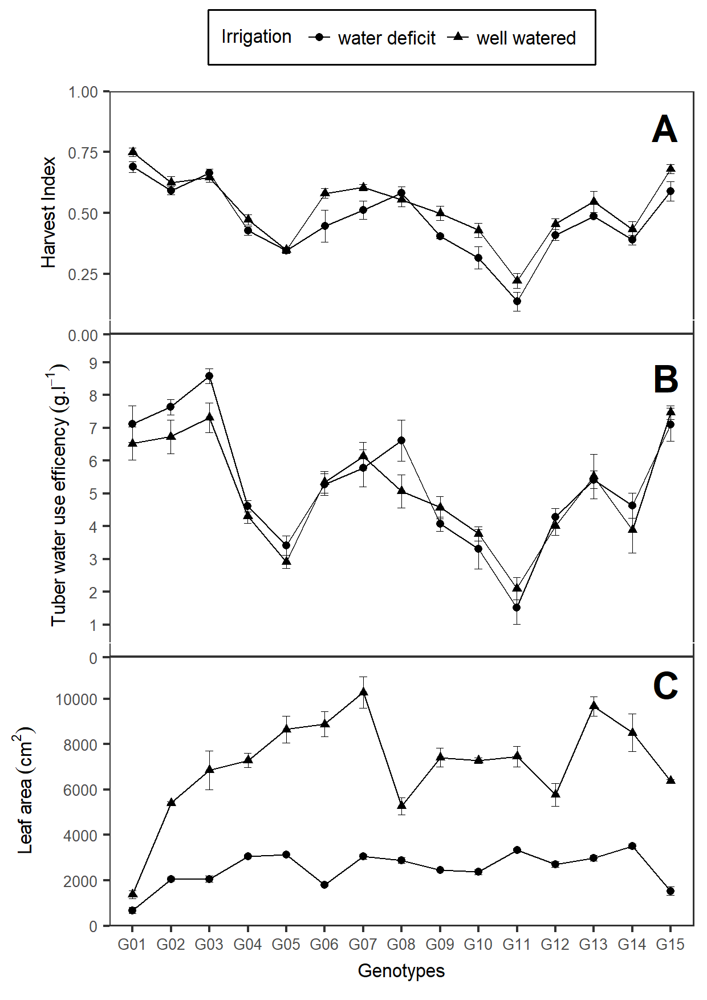
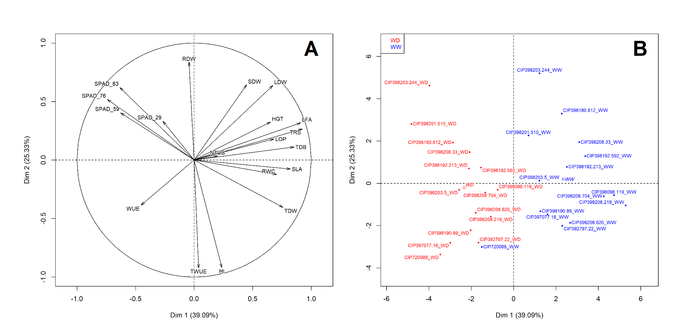

```{r setup, include=FALSE}

knitr::opts_chunk$set(fig.align = "center",
	echo = FALSE, message = FALSE, warning = FALSE)

options(digits = 4, OutDec= ".",
        knitr.kable.NA = '',
        knitr.table.format = "pandoc", 
        citr.use_betterbiblatex = FALSE)

library(bookdown); library(citr); library(knitr); library(rosr)
library(DT); library(inserttable) # devtools::install_github("lbusett/insert_table")
library(tidyverse); library(googlesheets)
library(agricolae); library(GerminaR); library(compareGroups); library(FactoMineR)
library(cowplot); library(grid); library(png); library(jpeg)

aut <- gs_ls()
gs <- gs_url("https://docs.google.com/spreadsheets/d/1dfgpmCKdPmxRHozrZp0iE_xMGsvKTIcztDpMWYSEGaY/edit#gid=142311263") 
# browseURL(gs$browser_url)
# browseURL("https://flavjack.github.io/rticles/")

fb <- gs %>%
  gs_read(ws = "fb") %>%
  select_all("tolower") %>% 
  select_all(~gsub("\\s+|\\.", "_", .)) %>% 
  mutate(treat = ifelse(treat == "wellwater", "WW", "WD")) %>% 
  select(block, treat, genotype, 
         spad_29 = spad_29dap, 
         spad_59 = spad_59dap, 
         spad_76 = spad_76dap, 
         spad_83 = spad_83dap,
         hgt = hgt_86dap,
         rwc = rwc_84dap,
         lop = op_84dap,
         ldw = leafdw,
         sdw = stemdw,
         rdw = rootdw,
         tdw = tubdw,
         ntub,
         trs = ttrns,
         lfa = la,
         rdl = rlg) %>% 
  mutate(tdb = (ldw+sdw+rdw+tdw),
         hi = tdw/(ldw+sdw+rdw+tdw),
         sla = lfa/ldw,
         wue = (ldw+sdw+rdw+tdw)/trs,
         twue = tdw/trs
         ) %>% 
  mutate(gnt = recode(genotype, 
                      "CIP720088" = "G01",
                      "CIP392797.22" = "G02",
                      "CIP397077.16" = "G03",
                      "CIP398192.213" = "G04",
                      "CIP398180.612" = "G05",
                      "CIP398208.704" = "G06",
                      "CIP398098.119" = "G07",
                      "CIP398190.89" = "G08",
                      "CIP398192.592" = "G09",
                      "CIP398201.510" = "G10",
                      "CIP398203.244" = "G11",
                      "CIP398203.5" = "G12",
                      "CIP398208.219" = "G13",
                      "CIP398208.33" = "G14",
                      "CIP398208.620" = "G15"))

```

# Abstract {-}

Drought stress is a serious constraint affecting yields of almost all crops worldwide. The problem is only expected to get worse with water deficits stemming from climate change and population expansion. In this study, we aim to find traits that can help the plants tolerate water deficit without the resultant yield lost, understand the mechanisms of tolerance, and provide useful information for the selection of tolerance in breeding programs. In order to explore the different responses of potato under drought, we have evaluated fifteen genotypes under well watered (WD) and water deficit (WD) conditions for a range of agro-morphological and physiological traits. 

Critically, tolerant genotypes such as CIP397077.16, CIP398190.89, and UNICA were able to preferentially put limited water toward tuber production rather than biomass. We also found a lower specific leaf area (SLA) under WD, and that potato genotypes with the ability to maintain high SPAD and low SLA under WD can also maintain high WUE. 

**Key words:** abiotic stress, harvest index, lisimeter, drought tolerance

# Introduction

Plant biomass accumulation, and consequently yield, was shown to be inextricably linked to transpiration. The ratio of plant productivityto waterloss, water-useefficiency, was very conservative [@sinclair1984WaterUse].

This ratio is called harvest index (H) and has been found to be relatively stable for a particular cultivar over a fairly wide range of conditions (Donald and Hamblin 1976).

Evans (1980) suggested that one of the main variables for yield increases seen to date has been increases in harvest index.

Evans (1980) further suggested that additional large increases in harvest indices are unlikely. Therefore, further increases in water-use efficiency based on marketable yield are not likely from increasesin the harvest index.

Passioura (1977) and Fischer (1979) have argued that obtaining high harvest indexes underwater-limitedconditions is especially importantin obtaining high water-use efficiencies.


Passioura (1977) proposed that cereals for water-limited environments be developed with roots with restricted water uptake rates. Again, such an alteration would, in principle, conserve water during vegetative growth leaving more soil waterfor extraction during grain development. The key aspect of both strategies is that sustained reproductive growth is essential for a high harvest index.

However, a deeper and more extensive rooting system may have drawbacks. A greater root biomass would almost surely result in lowered harvest index (in potato can be advantage?)

Improved harvest index. As illustrated in equations(7) and(9) improvements in harvest index result directly in increased water-use efficiency. The difficulty is that for many crops it appears that further substantial improvements in harvest index are unlikely.


<!-- Water has become a scarce and precious resource and its efficient utilization in the production of food is a key challenge in agriculture worldwide. Yield losses due to water deficit are one of the global problems limiting production. Tracking the consequences of water deficit in plants is a difficult task, as it depends on the timing, intensity, type of crop, and duration of stress [@blum2011Drought]. Besides this, abiotic stresses never come alone but are coupled in nature with other location-specific environmental stress factors, such as high irradiance and temperature, which makes describing the effect of one single stress in the field nearly impossible.  -->

<!-- Peru is the center of potato origin, where native varieties grown are easily accessible for use in breeding for desirable drought tolerance traits. Potato is an important non-grain food crop and is a key component of world food security. Potato is known to be sensitive to water deficit because of its shallow root system, and its fast-closing leaf stomata that reduce transpiration and photosynthesis, considerably reducing tuber yields [@deblonde2001Effects]. Nevertheless, potato has a high harvest index in comparison with cereals and relatively low demand for water.  -->

<!-- Tuber initiation is the most critical period of a potato’s life span in terms of water due to its high demand of around 400 to 600 L for 1kg of tuber dry matter [@stark2013Potato]. Thus, an effective water-saving method is highly desirable trait for potato in semi-arid areas.  To increase yield per unit of water, crop demand for water should be reduced or be used efficiently. Plants need to be bred for  water use efficiency (WUE) by capturing traits that help the plants develop faster, flower earlier, have a lower leaf area index, and be more efficient in capturing radiation [@blum2005Drought; @hochman2009Potential]. In addition to the morphological changes, water use can be improved by maintaining low stomatal conductance (g~s~) during vegetative stages. This simple change is extremely beneficial, as the higher transpiration efficiency (TE) helps to postpone water use to late growing stages and alters the relationship between the dry matter produced and the quantity of soil water consumed [@carli2014Effect; @condon2004Breeding]. The management of water has a marked influence on plant behavior, tuber production, and quality. An important component of adaptation to WUE, the efficiency of the amount of water applied and used for transpiration that goes toward dry matter production. Enhanced WUE can reduce crop water requirements and increase crop yield significantly [@tolk2009Transpiration]. In this way, when a higher WUE under drought is maintained, the effects of water deficit are reduced and the competitiveness for water in drought conditions enhanced [@ogaya2003Comparative].  -->

<!-- The WUE was found to be greater in the summer due to the greater harvest index (HI) and more-efficient interception of solar radiation per unit of applied water by drought-exposed than by well-watered plots [@trebejo1990Effect]. In normal conditions when irrigation is sufficient to meet the transpiration needs of the crop, genotypes with higher stomatal conductance and low WUE, able to extract more water from the soil, will have higher yield. In contrast, when water is not sufficient, the low WUE arising from a high rate of transpiration leads to low yields in favor of dry matter partitioning to reproductive organs [@tuberosa2012Phenotyping]. -->

<!-- This study emphasizes the potential penalties in yield of thirteen advanced potato clones and two commercial varieties that are likely to arise in water-limited conditions, and explores the interrelationship between traits that help plants to mitigate yield losses under water-limited conditions. Chlorophyll content (SPAD), relative water content, osmotic potential, specific leaf area (SLA), transpiration efficiency, root length, stolon mass and tolerance to decrease water supply (TDWS), among other traits, were evaluated to identify convenient indicators of plant water status that helps in the selection of clones with high tolerance to water deficit. -->

# Materials and Methods

## Plant material and experimental design

Thirteen potato clones were selected from advanced breeding population collection at International Potato Center (CIP) and two commercial varieties were grown in an environmentally controlled greenhouse at CIP (La Molina Experimental Station) at 28/15°C day/night with 70±5% average relative humidity. The experiment was carried out in complete randomize block design where the first factor was the two irrigation treatments: well-watered (WW), treatment where the moisture was maintained at field capacit and water deficit (WD) and the second factor were compound by the fifteen potato genotypes, Table (\@ref(tab:gnt)).


```{r gnt}

gnt <- gs %>% 
  gs_read(ws = "gnt") %>% 
  dplyr::select(Number, Genotypes, Adaptability, "Growning period" = GPL, "Heat tolerance" = Heat, "Dry matter (%)") 

gnt %>% kable(caption = "Potatos (*Solanum tuberosum* L.) genotypes used for water deficit experiment with  13 lines from advanced breeding population at International Potato Center (CIP) and two comercial varieties.")

```

## Relationship between transpiration rate and soil water supply

Single plants were grown in a greenhouse in 5 liters plastic pots and It was sown containing 5 kg of dry commercial Sogemix SM2 (75% Peat Moss, perlite, vermiculite, and limestone). Fertilization was done twice with ammonium nitrate; triple superphosphate and potassium sulphate, one before planting mixed with the substrate and the other applied at the surface at 40 days after planting (DAP).

The pots from both well water (WW) and water deficit (WD) treatments were watered to soaking and then allowed to drain overnight. Next day, soil evaporation was minimised by sealed with a plastic bag and all the pots were weighed and it was defined as the initial pot weight. Water deficits were imposed at 45 DAP that coincides with the beginning of the development of the stolons.

Transpiration was calculated by weighing the pots every two days in the between 13:00 and 15:00 hours (GMT -05:00). The transpiration (trs) of each plant was calculated by the procedure previously described by @bhatnagar-mathur2007Stressinducible and @ray1998effect. The inter-daily transpiration rates of WD plants were normalized against WW plant rates to reduce the influence of day-to-day variation ($TRS=\left(\frac{WD_{transpiration}}{WW_{transpiration\ average}}\right)$). The normalization was achieved by dividing transpiration of each individual plant in the WD regime by the mean transpiration of the WW plants. For compare the TRS between plants, a second normalization was done so that the normalized transpiration rate (NTR) of each plant was defined in 1.0 when the soil water content in each pot was at field capacity [@sinclair1986Influence]. The available soil water or the fraction of transpirable soil water (FTSW), for each pot was calculated by dividing the pot weight minus the final pot weight by the transpirable soil water of that pot ($FTSW=\left(\frac{pot\ weight_{inter-daily}-pot\ weight_{final}}{pot\ weight_{initial}-pot\ weight_{final}}\right)$). 

## Trait evaluation

### Water use efficiency

Water use efficiency (WUE) is defined as a ratio of biomass accumulation, total crop biomass or crop grain yield, to water consumed, expressed as transpiration, evapotranspiration, or total water input to the system [@sinclair1984WaterUse]. According to this concept we calculated the biomas water use efficency (wue) and tuber water use efficency (TWUE). The WUE was calculated as the total biomass in dry weight produced divided by the cumulative water transpired [@dallacosta1997Yield] and for TWUE was used the dry weight from tuber production divide the cumulative water transpired during the treatment. 

### Water components

The relative water conten (RWC) was determined by weighing the third leaflet (FW) from the third leaf from the apical part from the youngest fully expanded leaf of each plant. Each leaflet were placing in a 4x3 inch ziploc bag containing distilled water for 24 hours and after these time it was removed to taking turgid weight (TW) afterwards it was dried in an oven at 90 ºC for 24 hours and weighed (DW). The RWC was calculated according to @vasquez-robinet2008Physiological by the formula $RWC\left(\%\right)=\left(\frac{leaflet_{FW}-leaflet_{DW}}{leaflet_{TW}-leaflet_{DW}}\right)\cdot100$.

Leaf osmotic potential (LOP) was determined using a dew point microvoltmeter (HR-33T Wescor Inc., Logan, UT, USA) with leaf discs of 5 mm diameter, taken from the third fully extended leaf. The leaf discs were put in 1 ml cryogenic tubes and frozen in liquid nitrogen for further analysis. The frozen leaves were incubated at 22°C for 30 min in a sealed C-52 chamber (Wescor Inc., Logan, UT, USA). The total osmotic adjustment (TOA) was defined as the difference in LOP between the WW and the WD plants [@hessini2009Effect]. 

## Chlorophyll content (SPAD) 

The chlorophyll content of the plant was evaluated by taking SPAD measurements using a SPAD-502 chlorophyll meter (Konica Minolta Sensing, Inc., Osaka, Japan) from the third youngest fully expanded leaf from three points (upper, middle and lower leaflet of a leaf). Individual readings of leaflets were averaged to represent individual measurement of a leaf. The evaluations were done on light adapted leaves at 29, 59, 76, and 83 DAP. 

## Post-harvest traits and indices 

The harvest was at 90 DAP. The plants were separated in four components: leaves, stems, roots and tubers. The dry weight (g) components were determined by drying them at 80°C for 3 days in a forced air oven: leaf (LDW), stem (SDW), root (RWD), tuber (TDW). The leaf area (LFA) of the plants was measured in cm^2^ by taking photographs of all the leaves arranged on a wooden board and analyzing the pictures using SisCob v1.0 (EMBRAPA Instrumentação Agropecuária, 2003). 

The tolerance to decrease of water supply (TDWS) or the percentage of yield reduction was the index used to evaluated the drougth tolerance and it is used to characterize the response of each genotype to WD [@deblonde1999Responses; @lahlou2003effect]. To calculate TDWS the TDW in WD treatment for every genotype was expressed relative to its TDW in the WW treatment. The harvest index (HI) was calculated as the ratio of TDW related to the total dry biomass (TDB) and specific leaf area (SLA) was calculated by dividing the LFA with LDW. 

## Statistical analysis

The experiment was carried out in a complete randomize block design with two factros; the irrigation with well water (WW) and water deficit (WD) treatments and fifteen potato genotypes. Each treatment consisted of five replicates with one potato plant for each experimental unit. Statistical analysis and graphs were performed in the statistical software R [@R-base; @R-GerminaR]. The analysis of variance (ANOVA) was performed to evaluate the differences between the factors and the comparison of the means with the Student-Newman-Keuls test (p<0.05) from agricoale package [@R-agricolae]. For the multivariate analysis correlation analysis was performed [@R-agricolae; @R-corrplot] and principal components analysis were made with FactoMineR package [@R-FactoMineR].

# Result


## Treatment application


## Traits evaluation


## Multivariate analysis


## Multiselection index


<!-- Large differences existed among genotypes in total biomass dry weight (kgDW.m2) of well-watered (WW) plants at the end of the experiment (Figure 1a). Water deficit (WD) treatment had a significant effect (P < 0.001) with an average reduction of around 29% in comparison with the well-watered treatment (Figure 1a). CIP398190.89 was the only genotype with a 5% increase in biomass, and CIP398208.219 was the most affected by WD (~44% reduction in comparison with WW). In terms of productivity, WD decreased tuber yield (kgDW.m2) across genotypes by an average of 39% (P < 0.01), however, CIP398190.89 increased its productivity by 5%, while others like CIP398203.5 and CIP398203.244 presented up to 56% and 48% reduced tuber production (Figure 2a). CIP398190.89 had greater tuber dry weight (g) in WD compared to its yield in WW treatment, with a TDWS of 104.09%, indicating drought tolerance (Figure 1a). Most genotypes had similar performance under drought, such as UNICA (CIP392797.22) with 75.76% and CIP398208.33 with 71.9% TDWS. The genotypes CIP398203.244, CIP398208.219, and CIP398201.510 were among the most sensitive genotypes at 31.56, 46.75 and 48.88% respectively (Figure 1a).  -->

<!-- Differences among genotypes (p<0.001) and treatments (p<0.01) were found for harvest index (HI) (Figure 2b). Dry matter partitioning in CIP3977077.16 and CIP398190.89 under WD as shown by HI were not significantly different from that of the WW treatment. A strong negative correlation among root length and HI was found in both treatments (r= -0.73) -->
<!-- The specific leaf area (SLA) reduction was 48% under WD compared to WW (Figure 2c). CIP398190.89 together with CIP398203.5 were among the clones with lowest reduction (24 and 21% respectively), while CIP398208.219, CIP398098.119, and CIP398208.704 were among the clones with highest SLA reduction (53, 65, and 64% respectively). -->

<!-- There were significant (p<0.05) differences between genotypes for maximum rooting depth and stolon mass, but only stolon mass behaved differently under water deficit treatment (Figure 3).  -->

<!-- SPAD units taken over the course of plant development (29, 59, 76, and 83 DAP) showed that at 29 DAP all plants were at the same stress level as no treatment difference was found (Supplementary Table 1). By the end of the experiment, difference between treatment (T), genotypes (G), and G*T were found and the values were lower than at 29 DAP. WD values for all the genotypes were higher than the ones at WW conditions. The genotypes CIP398190.89 and CIP720088 had the lowest differences among treatments for SPAD at 83 DAP (2.06 and 0.30%, respectively), while CIP398203.244 and CIP398208.33 had the largest (14.48 and 17.54%, respectively) (Supplementary Table 1). -->

<!-- Leaf relative water content (RWC) significantly (p < 0.01) decreased in response to WD in all the genotypes (Supplementary Table 1). The values ranged between 64.96% and 50.09% for CIP720088 and CIP398201.510, respectively. Differences in osmotic potential (OP) among genotypes and treatments were also significant (P < .001) (Supplementary Table 1). -->

<!-- Water use efficiency (WUE) was generally higher in WD than WW plants (Figure 4a). Under WD treatment, CIP397077.16, CIP398208.620 and CIP398190.89 showed the highest efficiency (13.06, 12.03, and 11.59 g.L-1, respectively), while the lowest efficiencies (8.50 and 9.24 g.L-1) were presented by CIP398180.612 and CIP398203.5, respectively. CIP398208.620) (10.80 g.L-1 for WW and 12.03 g.L-1 for WD) and CIP398180.612 (8.36 g.L-1 for WW and 8.50 g.L-1) maintained similar WUE (higher or lower) in both treatments (Figure 3a). Tubers used a great portion of the water uptake (Figure 4b), at least for the tolerant genotypes (CIP398190.89, CIP397077.16, and UNICA), in which tubers either from WW or WD are alike (Sup.Fig.1). On the other hand, the sensitive genotype CIP398203.244 produced more leaves and stems rather than tubers.  -->

<!-- The values of total biomass (kgDW.m-2) and total transpiration (L) were strongly and positively correlated across (r= 0.92, P < .0001) all genotypes and per treatment (Fig.5a). WUE was also correlated with both total biomass and tuber yield (r = 0 .55, p < .05; and r = 0.78, p < 0.001 respectively) (Figure 5b and Supplemental Table 1). The efficiency of use of transpired water was 34.9% higher in CIP397077.16, compared to CIP398180.612. Genotypic variability was also noted in terms of TDWS and HI and three clear groups (tolerant, medium, sensitive) can be distinguished based on TDWS and HI. CIP397077.16, UNICA, CIP398208.620, and Achirana-INTA were ranked as tolerant while CIP398203.244 was rated as sensitive (Figure 5c). The leaf (r = 0.79), stem (r = 0.69), and tuber biomass (r = 0.56) were also positively correlated with transpiration. Almost all characteristics evaluated showed significant differences between treatments (Supplementary Table 2). Only SPAD29, before the start of the drought treatment, and root length did not show significant differences.  -->

# Dicussion


<!-- SPAD measurements of the leaf were used as an indicator of nitrogen status and leaf senescence.  -->


<!-- Water deficit (WD) triggered a range of morphological and physiological mechanisms in the potato genotypes tested, leading to different yield penalties and indicating a variety of survival strategies by potato. We found root length, SPAD, and SLA to be good indicators for water use efficient (WUE) plants useful for drought tolerance breeding. Most characteristics measure showed differences between treatments, pointing to their value in evaluating the impact of drought. According to (Songsri et al. 2009), enhanced extraction of water and nutrients from the soil due to large root system and long roots is a drought resistance mechanism in potato. Our study showed that the minimal yield losses in some genotypes like CIP398190.89 under WD could be related to its ability to increase its WUE (Figure 4a), by absorbing the limited water and nutrients available in the soil without changing its morphology. However, in our study, the genotype with the longest roots (CIP398201.510) (Fig. 3a) showed the lowest yield (Fig. 2a) and HI (Fig. 2b) under both stressed and non-stressed conditions. In this genotype, the long roots seem to contribute to vegetative growth rather than harvestable yield.  -->
<!-- Another drought resistance mechanism can be the reduction of transpiration achieved by the reduction of leaf area, for example, thick leaves often have greater photosynthetic capacity than thin leaves, due to their higher chlorophyll per leaf area counts (Songsri et al. 2009). SPAD is an indicator of the photosynthetically active light transmittance characteristics of the leaf, which is dependent on the unit amount of chlorophyll per unit leaf area. SPAD units have been correlated with chlorophyll and carotenoid content in potato and other crops (Ramírez et al. 2014: Marenco et al. 2009) and are used in selecting genotypes tolerant to drought in breeding programs. In this study, some genotypes reduced specific leaf area (SLA) (Fig. 2c), and changed the ratio of root to shoot (Sup. Table 1), while others, like CIP3977077.16 and CIP398190.89 maintained SLA, as well as harvest index (HI) (Fig. 2b), root length and stolon mass (Fig. 3) under WD. These genotypes may have lower sink competition and allocated a proportionally higher fraction of assimilates to tubers by reducing the evaporative surface area above-ground and efficiently employing the resources (water saved and N) located in the soil. Conversely, sensitive genotypes such as CIP398203.244 preferred to produce leaves and stems in preference to tubers. Our study also found a lower specific leaf area (SLA) under WD (Figure 2c), principally explained by decreases in new leaf production, number of leaves, and leaf size. This decrease might have had allowed a reduction in leaf transpiration, saving water for tuber bulking as suggested by Lahlou, et al. (2003). Hence, potato genotypes with the ability to maintain higher SPAD and lower SLA under WD conditions, can maintain higher WUE under WD conditions. -->

<!-- It is important to remember that under WW conditions, soil can supply water at a steady rate to meet the transpiration demand. However, as the soil becomes dry, water flux from soil to root surface decreases and cannot satisfy the demand of transpiration. Additionally, in WD conditions, mineralization and supply of nutrients, especially N, is reduced, forcing the plant to use their resources efficiently as the only solution to not compromise yield (Motalebifard et al. 2013). Payne et al. (1995) found that N uptake was linearly related to plant transpiration, and that about twice as much N is taken up per kg of transpiration in water-stressed plants than in non-water-stressed plants. In our study, we found that CIP397077.16 and CIP398208.620 could maintain turgor, which, combined with the reduction of SLA, helped them to conserve water. Additionally, increased amounts of RWC under WD treatment in CIP720088 may have been the result of higher stomata conductivity, since the root length of CIP720088 in WW and WD treated plants were comparable (Figure 3a).  -->

<!-- The strong correlation between WUE in this experiment and tuber yield (r = 0 .78, p < .001) indicates direct association between them, and at the same time, reflected the conservative relationship between biomass production and WUE through a range of limited soil water availability.  Reduced stomatal conductance can constrain the diffusion of CO2 for photosynthesis, and accordingly the average total biomass in the WD treatment was significantly lower than that of the corresponding genotypes in WW treatment. Different studies have measured WUE at the leaf, whole plant, and crop levels (Guoju et al. 2013; Hochman et al. 2009) and have found no significant differences at plant or crop levels (Deblonde et al. 1999). In this study, WUE is considered a critical trait that can affect yield and its increase can lead a plant to tolerate or avoid water deficit conditions.  -->

# Conclusions

<!-- Based on our results, the genotypes with reduced SLA, longest root length and that maintain relatively high WUE under WD conditions, like CIP398201.510, are drought avoidant. Additionally, we found that tolerant genotypes like CIP397077.16, CIP398190.89, and UNICA preferentially use available water for tuber production rather than above ground biomass (Figure 5b). Our study demonstrated that root length, SPAD and SLA are important traits related to WUE and could be useful as selection criteria of new genotypes. However, there are additional strategies of the below-ground plant parts that need to be explored for their role in yield stability under water stress conditions. -->


# Acknowledgments

Authors acknowledge the financial support by BMZ/GIZ through a research grant for “Improved potato varieties and water management technologies to enhance water use efficiency, resilience, cost-effectiveness, and productivity of smallholder farms in stress-prone Central Asian environments”.We also thank Jorge Vega and David Saravia for their help during installation and evaluation of the experiment.

# Tables {-}

## Abbreviations

SPAD = Soil Plant Analysis Development \
HGT = Height \
RWC = Relative water content \
LOP = Leaf osmotic potential \
LDW = Leaf dry weight \
SDW = Stem dry weight \
RDW = Root dry weight \
TDW = Tuber dry weight \
NTUB = Tuber number \
TRS = Total transpiration \
LFA = Leaf area \
TDB = Total dry biomass \
HI = Harvest index \
SLA = Specif leaf area \
WUE = Water use efficiency \
TWUE = Tuber water use efficiency
         

```{r rnk}

rnk <- fb %>%
  filter(treat == "WD") %>%
  as.data.frame() %>% 
  st4gi::elston(traits = c("tdw", "ntub", "rwd", "lfa", "hi", "twue"),
                       geno = "genotype", env = "treat", dfr = .) %>%
  dplyr::arrange(E.Rank) %>% 
  rename(Genotype = geno)

rnk %>% 
  kable(caption = "The best genotypes ranking accroding Elston index for best tuber dry weight (TDW), tuber number (NTUB), root dry weight (RWD), leaf area (LFA), harvest index (HI), tuber water use efficency (TWUE). Ref: Elston, R. C. (1963). A weight-free index for the purpose of ranking or selection with respect to several traits at a time. Biometrics. 19(1): 85-97.")

```

# Figures {-}

```{r srl, fig.align='center', fig.cap= "Soil transpiration fraction and transpiration during the experiment"}

Sys.sleep(6)

fts <- gs %>%
  gs_read(ws = "FTSW") %>%
  filter(Treatment != "preharvest") %>%
  tidyr::gather(key = day, value = fts, -ID, -Genotype, -Treatment)

av <- aov(fts ~ Treatment*day, fts)
mc <- GerminaR::ger_testcomp(av, c("Treatment", "day"))

plt1 <- fplot(data = mc, type = "line", color = F,
             x = "day",
             y = "mean",
             z = "Treatment",
             ylab = "Soil transpiration fraction",
             xlab =  "Days",
             lgl = "Irrigation",
             zbl = "water deficit  well watered",
             lgd = "top",
             lmt = c(0,1.1),
             brk = 0.1,
             erb =  T) +

  theme(axis.title.x=element_blank(),
        axis.text.x=element_blank(),
        axis.ticks.x=element_blank())

trns <- gs %>% 
  gs_read(ws = "Transpiration") %>%
  filter(Treatment != "preharvest") %>%
  tidyr::gather(key = day, value = trans, -ID, -Genotype, -Treatment) %>%
  filter(day != "TOTAL") %>%
  drop_na()

av <- aov(trans ~ Treatment*day, trns)
mc <- GerminaR::ger_testcomp(av, c("Treatment", "day"))

plt2 <- fplot(data = mc, type = "line", color = F,
             x = "day",
             y = "mean",
             z = "Treatment",
             ylab = "Transpiration (ml)",
             xlab =  "Days",
             lgl = "Irrigation",
             zbl = "water deficit  well watered",
             lgd = "none",
             lmt = c(0,790),
             brk = 100,
             erb =  T)

# plot <- ggdraw(xlim = c(0, 0.5), ylim = c(0, 0.5))+
#   draw_plot(plt1,  width = 0.494, height = 0.25, x = 0.0055, y = 0.234) +
#   draw_plot(plt2,  width = 0.5, height = 0.25, x = 0.0, y = 0.0) +
#           draw_plot_label(
#             label = c("A", "B"),
#             x = c(0.45, 0.45),
#             y = c(0.43, 0.23))


# cowplot::ggsave("img/fig01.png", dpi= 300, width = 210*0.5 , height = 297*0.5, units = "mm")
#
# 


```


```{r var, fig.align='center', fig.cap="Harvest Index, tuber water use efficency"}

# HI
av <- aov(hi ~ gnt*treat + block, fb)
#summary(av)

mc <- GerminaR::ger_testcomp(av, c("gnt","treat"))

plt1 <- fplot(data = mc, type = "line", color = F,
             x = "gnt",
             y = "mean",
             z = "treat",
             ylab = "Harvest Index",
             xlab =  "Genotypes",
             lgl = "Irrigation",
             zbl = "water deficit  well watered",
             lgd = "top",
             lmt = c(0, 1),
             erb =  T) +

  theme(axis.title.x=element_blank(),
        axis.text.x=element_blank(),
        axis.ticks.x=element_blank())


# TWUE

av <- aov(twue ~ gnt*treat + block, fb)
#summary(av)

mc <- GerminaR::ger_testcomp(av, c("gnt","treat"))

plt2 <- fplot(data = mc, type = "line", color = F,
             x = "gnt",
             y = "mean",
             z = "treat",
             ylab = "Tuber water use efficency (g.l^{-1})",
             xlab =  "Genotypes",
             lgl = "Irrigation",
             zbl = "water deficit  well watered",
             lgd = "none",
             lmt = c(0,9.9),
             brk = 1,
             erb =  T) +

  theme(axis.title.x=element_blank(),
        axis.text.x=element_blank(),
        axis.ticks.x=element_blank())


# LFA

av <- aov(lfa ~ gnt*treat+ block, fb)
#summary(av)

mc <- GerminaR::ger_testcomp(av, c("gnt","treat"))

plt3 <- fplot(data = mc, type = "line", color = F,
             x = "gnt",
             y = "mean",
             z = "treat",
             ylab = "Leaf area (cm^2)",
             xlab =  "Genotypes",
             lgl = "Irrigation",
             zbl = "water deficit  well watered",
             lgd = "none",
             lmt = c(0,11900),
             brk = 2000,
             erb =  T)


# plot <- ggdraw(xlim = c(-0.02, 0.5), ylim = c(0, 0.7))+
#   draw_plot(plt1,  width = 0.5, height = 0.25, x = 0.0, y = 0.452) +
#   draw_plot(plt2,  width = 0.497, height = 0.25, x = 0.003, y = 0.226) +
#   draw_plot(plt3,  width = 0.522, height = 0.25, x = -0.022, y = 0.0) +
#           draw_plot_label(
#             label = c("A", "B", "C"),
#             x = c(0.45, 0.45, 0.45),
#             y = c(0.63, 0.455, 0.24))


# cowplot::ggsave("img/fig02.png", dpi= 300, width = 210*0.5 , height = 297*0.5, units = "mm")
#
# 


```


```{r mlt, fig.align='center', fig.cap="Principal component analysis"}

mvd <- fb %>%
  select(-block, -gnt) %>%
  group_by(treat, genotype) %>%
  summarise_all(funs(mean), na.rm = TRUE) %>%
  mutate(coln = paste(genotype, treat,  sep = "_")) %>%
  column_to_rownames("coln") %>%
  select(-genotype)

pca <- PCA(mvd, graph = F, scale.unit = TRUE, quali.sup = 1)

# Analalisis de componentes principales

# ppi <- 300
# png("img/pca_var.png", width=8*ppi, height=8*ppi, res=ppi)
# 
# plot.PCA(pca,choix="var",
#          title="",
#          autoLab = "y", cex = 0.8, shadowtext = T)
# 
# graphics.off()
# 
# 
# ppi <- 300
# png("img/pca_ind.png", width=8*ppi, height=8*ppi, res=ppi)
# 
# plot.PCA(pca,choix="ind", habillage = 1, col.hab=c("red","blue"),
#          title="",
#          autoLab = "y", cex = 0.7, shadowtext = T)
# 
# graphics.off()

# Resumen de resultados

#  summary(pca, nbelements = Inf)

# Correlacion de dimensiones

# dimdesc(pca)

# Analisis de Hierarchical Clustering

# ppi <- 300
# png("img/Fig_03.png", width=8*ppi, height=8*ppi, res=ppi)
#
# clus <- HCPC(pca, nb.clust=-1)
#
# graphics.off()

# pcv <- png::readPNG("img/pca_var.png") %>%
#   grid::rasterGrob(interpolate = TRUE)
#
# pci <- png::readPNG("img/pca_ind.png") %>%
#   grid::rasterGrob(interpolate = TRUE)
#
# plot <- ggdraw(xlim = c(0.05, 0.8), ylim = c(0, 0.5))+
#   draw_plot(pcv,  width = 0.5, height = 0.5, x = 0.0, y = 0.0) +
#   draw_plot(pci,  width = 0.5, height = 0.5, x = 0.35, y = 0.0) +
#           draw_plot_label(
#             label = c("A", "B"),
#             x = c(0.37, 0.723),
#             y = c(0.45, 0.45))

# cowplot::ggsave("img/fig03.png", dpi= 300, width = 210*0.9 , height = 297*0.3, units = "mm")
#
# 

```

```{r p4, fig.align='center', fig.cap="SPAD at 29 and 83 days after planting"}

# WUE

av <- aov(wue ~ gnt*treat + block, fb)
#summary(av)

mc <- GerminaR::ger_testcomp(av, c("gnt","treat"))

plt2 <- fplot(data = mc, type = "line", color = F,
             x = "gnt",
             y = "mean",
             z = "treat",
             ylab = "Water use efficency (g.l^{-1})",
             xlab =  "Genotypes",
             lgl = "Irrigation",
             zbl = "water deficit  well watered",
             lgd = "top",
             lmt = c(7,15),
             brk = 1,
             erb =  T)


  # theme(axis.title.x=element_blank(),
  #       axis.text.x=element_blank(),
  #       axis.ticks.x=element_blank())


# SPAD 29

av <- aov(spad_29 ~ gnt*treat + block, fb)
#summary(av)

mc <- GerminaR::ger_testcomp(aov = av, comp = c("gnt","treat"))

plt1 <- fplot(data = mc, type = "line", color = F,
             x = "gnt",
             y = "mean",
             z = "treat",
             ylab = "SPAD 29 DAP",
             xlab =  "Genotypes",
             lgl = "Irrigation",
             zbl = "water deficit  well watered",
             lgd = "top",
             erb =  T,
             lmt = c(40,70),
             brk = 5)


  # theme(axis.title.x=element_blank(),
  #       axis.text.x=element_blank(),
  #       axis.ticks.x=element_blank())


# SPAD 83

av <- aov(spad_83 ~ gnt*treat + block, fb)
#summary(av)

mc <- GerminaR::ger_testcomp(aov = av, comp = c("gnt","treat"))

plt2 <- fplot(data = mc, type = "line", color = F,
             x = "gnt",
             y = "mean",
             z = "treat",
             ylab = "SPAD 83 DAP",
             xlab =  "Genotypes",
             lgl = "Irrigation",
             zbl = "water deficit  well watered",
             lgd = "top",
             erb =  T,
             lmt = c(30,60),
             brk = 5)

  # theme(axis.title.x=element_blank(),
  #       axis.text.x=element_blank(),
  #       axis.ticks.x=element_blank())

# RWC

av <- aov(rwc ~ gnt*treat + block, fb)
#summary(av)

mc <- GerminaR::ger_testcomp(av, c("gnt","treat"))

plt1 <- fplot(data = mc, type = "line", color = F,
             x = "gnt",
             y = "mean",
             z = "treat",
             ylab = "Relative water content ('%')",
             xlab =  "Genotypes",
             lgl = "Irrigation",
             zbl = "water deficit  well watered",
             lgd = "top",
             erb =  T,
             lmt = c(40,80),
             brk = 5)


  # theme(axis.title.x=element_blank(),
  #       axis.text.x=element_blank(),
  #       axis.ticks.x=element_blank())


# LOP

av <- aov(lop ~ gnt*treat+ block, fb)
#summary(av)

mc <- GerminaR::ger_testcomp(av, c("gnt","treat"))

plt2 <- fplot(data = mc, type = "line", color = F,
             x = "gnt",
             y = "mean",
             z = "treat",
             ylab = "Osmotic potential (Mpa)",
             xlab =  "Genotypes",
             lgl = "Irrigation",
             zbl = "water deficit  well watered",
             lgd = "top",
             lmt = c(-4,-1),
             brk = 0.5,
             erb =  T)


  # theme(axis.title.x=element_blank(),
  #       axis.text.x=element_blank(),
  #       axis.ticks.x=element_blank())


# TRS

av <- aov(trs ~ gnt*treat + block, fb)
#summary(av)

mc <- GerminaR::ger_testcomp(av, c("gnt","treat"))

plt1 <- fplot(data = mc, type = "line", color = F,
             x = "gnt",
             y = "mean",
             z = "treat",
             ylab = "Total transpiration (l)",
             xlab =  "Genotypes",
             lgl = "Irrigation",
             zbl = "water deficit  well watered",
             lgd = "top",
             lmt = c(2,12),
             brk = 0,
             erb =  T)


  # theme(axis.title.x=element_blank(),
  #       axis.text.x=element_blank(),
  #       axis.ticks.x=element_blank())


  # theme(axis.title.x=element_blank(),
  #       axis.text.x=element_blank(),
  #       axis.ticks.x=element_blank())


# SLA

av <- aov(sla ~ gnt*treat+ block, fb)
#summary(av)

mc <- GerminaR::ger_testcomp(av, c("gnt","treat"))

plt3 <- fplot(data = mc, type = "line", color = F,
             x = "gnt",
             y = "mean",
             z = "treat",
             ylab = "Specific leaf area (cm^2*g^{-1})",
             xlab =  "Genotypes",
             lgl = "Irrigation",
             zbl = "water deficit  well watered",
             lgd = "top",
             lmt = c(100,600),
             brk = 100,
             erb =  T)


  # theme(axis.title.x=element_blank(),
  #       axis.text.x=element_blank(),
  #       axis.ticks.x=element_blank())


```
