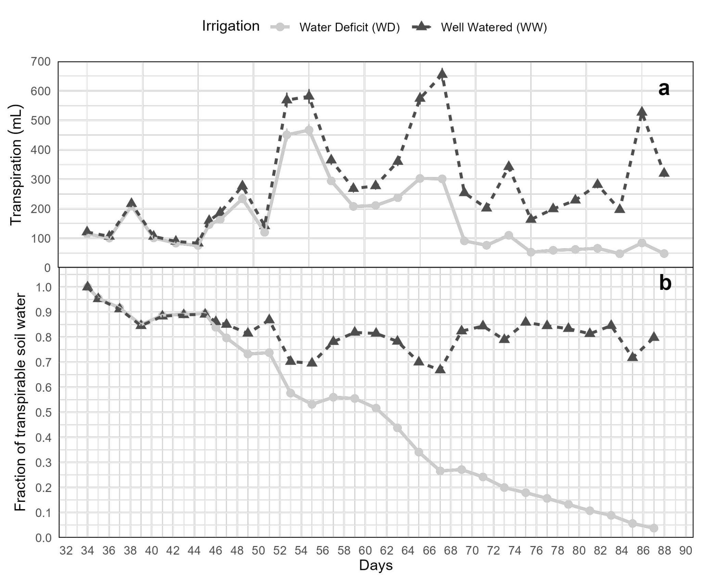
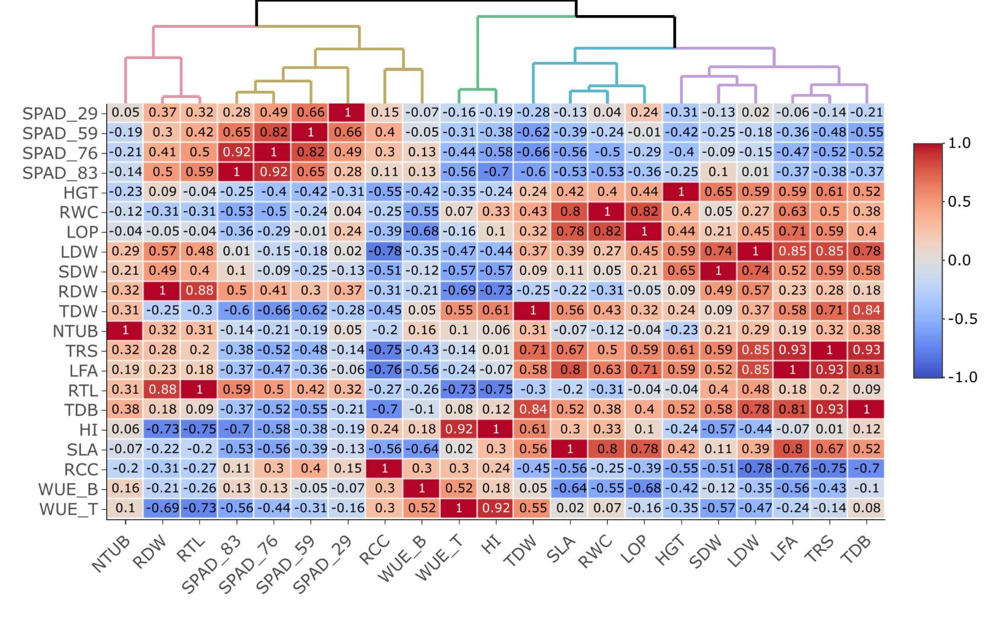
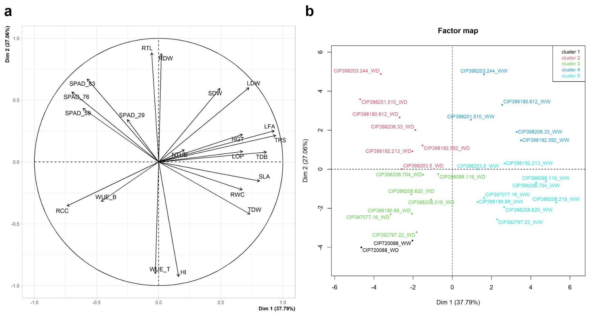

**Impact of water deficit on growth, productivity, and water use efficiency in potato genotypes (*Solanum tuberosum* L.)**

Flavio Lozano-Isla^1#\*^ (0000-0002-0714-669X), Evelyn Roxana Farfan-Vignolo^2#\*^ (0000-0002-8258-3902), Raymundo Gutierrez^1#^ (0000-0002-9238-5328), Raul Blas^1^ (0000-0003-3378-4035), Khan Awais^3#+^

^1^ Universidad Nacional Agraria La Molina, Facultad de Agronomía, Departamento Académico de Fitotecnia, Lima, Perú.

^2^ Dirección de Recursos Genéticos y Biotecnología, Instituto Nacional de Innovación Agraria (INIA), La Molina, Lima, Peru.

^3^ Plant Pathology and Plant-Microbe Biology Section, Cornell University, Geneva, NY, 14456, USA.

^#^ International Potato Center (CIP), Av. La Molina 1895, La Molina, 1558, Peru.

^+^ Corresponding author

^\*^ Equal contributing author

# Abstract

Drought stress, a serious constraint affecting the yields of almost all major crops, is expected to get worse from global climate change and human population expansion. Modern cultivars of potato (*Solanum tuberosum* L), the third most important food crop worldwide, are highly sensitive to drought stress. We evaluated a range of agro-physiological traits in 15 potato genotypes under well-watered (WW) and water deficit (WD) conditions to understand the impact of drought stress on yield and to identify traits to select drought-tolerant potato genotypes. Our results showed that the drought stress tolerant genotypes, CIP392797.22 (UNICA), CIP397077.16, CIP398190.89, CIP398208.219, and CIP398208.620 were able to preferentially put limited water toward tuber production rather than biomass. These genotypes have high tuber production under WW conditions and increased photosynthetic activity and water use efficiency under WD. Traits such as harvest index and SPAD showed high repeatability with 0.98 and 0.86 respectively suggesting they can be used to select drought-tolerant genotypes in breeding programs.

**Keywords:** abiotic stress, harvest index, physiological traits, drought tolerance, SPAD

# Introduction

Water has become a scarce and precious resource and its efficient utilization in food production is a key challenge worldwide. Specifically, yield losses due to drought are a global problem limiting agricultural production [(Hasegawa et al. 2021)](https://www.zotero.org/google-docs/?aNuKpd). Tracking the consequences of drought stress in plants is a difficult task, as it depends on the timing, intensity, type of crop, and duration of stress [(Seleiman et al. 2021)](https://www.zotero.org/google-docs/?vxzJ2Q). Potatoes are the third most consumed food crop worldwide [(Devaux et al. 2020)](https://www.zotero.org/google-docs/?41wILQ), and suffer drastic losses in tuber yield and/or quality due to drought stress [(Hill et al. 2021)](https://www.zotero.org/google-docs/?I9Eg2k). In general, the potato has a high harvest index in comparison with cereals and relatively low demand for water i.e., 400 to 600 L for 1 kg of tuber dry matter [(Monneveux et al. 2013; Sprenger et al. 2016)](https://www.zotero.org/google-docs/?X5LEq3). However, potatoes are sensitive to drought stress because of their shallow root system, and fast closure of stomata, which reduces transpiration and photosynthesis, considerably reducing tuber yields [(Joshi et al. 2016)](https://www.zotero.org/google-docs/?HATKjf). Periodic water shortages are critical, particularly at the tuber initiation stage. Therefore, potato cultivars with effective water-saving mechanisms leading to higher tolerance are highly desirable for semi-arid areas [(Monneveux et al. 2014)](https://www.zotero.org/google-docs/?1lwAyQ). The majority of modern potato cultivars are drought-sensitive presenting different responses to drought stress [(Soltys-Kalina et al. 2016; Sprenger et al. 2016)](https://www.zotero.org/google-docs/?5KYPX7). Drought stress tolerance in potatoes is a complex trait controlled by a large number of minor effect quantitative trait loci (QTL). Significant QTLs and differentially expressed genes under drought stress have been identified in potatoes [(Khan et al. 2015; Chen et al. 2020)](https://www.zotero.org/google-docs/?3REgbO). Potato cultivars have been shown to vary in morphological and physiological traits as well as biochemical and molecular pathways under drought stress [(Aliche et al. 2022)](https://www.zotero.org/google-docs/?ZYdRTp).

The potatoes were cultivated about 8000 years ago in Central Andes [(Lutaladio and Castaldi 2009)](https://www.zotero.org/google-docs/?65JJio); where landraces and wild potato relatives have a great diversity of physiological traits desirable for breeding potatoes with enhanced drought tolerance. Water use efficiency (WUE), the efficiency of the amount of water applied and used for transpiration that goes toward dry matter production, is an important trait for adaptation to drought stress.  Enhanced WUE can reduce crop water requirements and significantly increase crop yield [(Yu et al. 2020)](https://www.zotero.org/google-docs/?YLmwEz). When a higher WUE under drought stress is maintained, the effects of water deficiency are reduced and the competitiveness for water under drought conditions is enhanced [(Ogaya and Peñuelas 2003)](https://www.zotero.org/google-docs/?3QlEj3). WUE was found to be greater in summer in drought-exposed than in well-watered potato genotypes, due to greater harvest index and more-efficient interception of solar radiation per unit of applied water [(Trebejo and Midmore 1990)](https://www.zotero.org/google-docs/?BUgyJq). Cultivars can be bred for WUE, increasing yield per unit of water, by capturing traits that help the plants develop faster, flower earlier, have a lower leaf area index, and be more efficient in capturing radiation [(Condon 2020)](https://www.zotero.org/google-docs/?bG1UO3). Cultivars with low stomatal conductance during vegetative stages present higher transpiration efficiency with an improved relationship between dry matter production and the quantity of water utilized, which can ensure good tuber yield and quality under drought stress [(Carli et al. 2014)](https://www.zotero.org/google-docs/?GWrWvB). In normal conditions when irrigation is sufficient to meet the transpiration demand, potato genotypes with higher stomatal conductance and low WUE, extract more water from the soil and have higher yields. In contrast, when water is not sufficient, the low WUE arising from a high rate of transpiration leads to low yields in favor of dry matter partitioning to reproductive organs [(Tuberosa 2012)](https://www.zotero.org/google-docs/?PnyMdF).

The present study aims to understand the mechanisms for drought tolerance and physiological responses in 15 potato genotypes under water deficit conditions. Besides, the relationships between different agro-physiological and yield under water-limited conditions to select traits capable to differentiate drought-tolerant potato genotypes.

# Materials and Methods

## Plant material and experimental conditions

Two commercial varieties and thirteen potato genotypes from the advanced breeding population at the International Potato Center (CIP) were used in this study ([Table  @tbl:id.ela3e9ir5gqm]:). The commercial varieties were CIP392797.22 (UNICA) with a good yield in warm and dry environments [(Gutiérrez-Rosales et al. 2007; Rolando et al. 2015; Demirel et al. 2020)](https://www.zotero.org/google-docs/?LcYrXv); and CIP720088 (Achirana INTA) known for its earliness and drought tolerance [(Schafleitner et al. 2007)](https://www.zotero.org/google-docs/?LkdMBJ). 

The experiment was conducted at the International Potato Center (CIP) experimental station in Lima, Peru (12.1◦ S, 77.0◦ W, 244 m.a.s.l.) from May to September 2013. The plants were grown in a controlled greenhouse at 28/15°C average day/night temperature with 70±5% average relative humidity, monitored by a weather station ‘HOBO U12 Outdoor/Industrial model’ (Onset Computer Corporation, Bourne, MA, USA). The potato tubers were pre-sprouted for two weeks in a dark chamber before planting. Afterward, one tuber/genotype was sown at 5–7 cm depth in a 5 L plastic pot containing 5 kg of dry commercial Sogemix SM2 substrate (75% Peat Moss, perlite, vermiculite, and limestone). Fertilization was done twice during the experiment with 10 g of a mixture of granular fertilizer, urea, triple superphosphate, and diammonium phosphate in a ratio of 2:1:2, respectively, one before planting and the other applied at 40 days after planting (dap).

```Unknown element type at this position: UNSUPPORTED```


| **Number**                   | **Genotypes**                | **Adaptability**             | **Growing period**           | **Heat tolerance**           | **Dry matter (%)**            |
|------------------------------|------------------------------|------------------------------|------------------------------|------------------------------|-------------------------------|
| G01                          | CIP720088 (Achirana-INTA)    |                              | Early                        |                              | 19                            |
| G02                          | CIP392797.22 (UNICA)         | Lowland and highland Tropics | Medium                       |                              | 21                            |
| G03                          | CIP397077.16                 | Lowland tropics              | Medium                       |                              | 20                            |
| G04                          | CIP398192.213                | Mid elevation tropics        | Medium                       | Tolerant                     | 22                            |
| G05                          | CIP398180.612                |                              | Medium                       |                              |                               |
| G06                          | CIP398208.704                | Mid elevation tropics        | Medium                       | Tolerant                     | 24                            |
| G07                          | CIP398098.119                | Mid elevation tropics        | Medium                       | Tolerant                     | 26                            |
| G08                          | CIP398190.89                 | Mid elevation tropics        | Medium                       | Tolerant                     | 21                            |
| G09                          | CIP398192.592                | Mid elevation tropics        | Medium                       | Tolerant                     | 21                            |
| G10                          | CIP398201.510                | Mid elevation tropics        | Medium                       | Tolerant                     | 20                            |
| G11                          | CIP398203.244                | Mid elevation tropics        | Medium                       | Tolerant                     | 20                            |
| G12                          | CIP398203.5                  | Mid elevation tropics        | Medium                       | Tolerant                     | 13                            |
| G13                          | CIP398208.219                | Mid elevation tropics        | Medium                       | Tolerant                     | 22                            |
| G14                          | CIP398208.33                 | Mid elevation tropics        | Medium                       | Tolerant                     | 21                            |
| G15                          | CIP398208.620                | Mid elevation tropics        | Medium                       | Tolerant                     | 21                            |


: Potato genotypes (*Solanum tuberosum* L.) used for water deficit experiment with two commercial varieties and 13 genotypes from an advanced breeding population developed by the International Potato Center (CIP). Source: CIP {#tbl:id.ela3e9ir5gqm}


```Unknown element type at this position: UNSUPPORTED```## Experimental design and irrigation treatments 

The experiment was carried out in a complete randomized block design with two irrigation treatments with five replications of each genotype per treatment. In well-watered (WW) treatment, plants were irrigated according to their transpiration demand ([Figure  @fig:id.olts8je85fk5]:a), and water deficit (WD) treatment, the water supply was gradually reduced until the wilting point [(Ray and Sinclair 1998)](https://www.zotero.org/google-docs/?y2XuVg). At 35 dap, before the stress initiation, the pots were watered to soaking and then allowed to drain overnight [(Bhatnagar-Mathur et al. 2007)](https://www.zotero.org/google-docs/?aBxXpi). The next morning, the pots were sealed in a plastic bag secured with a twist tie to prevent water loss except by transpiration and arranged in the greenhouse according to the experimental design. Thereafter, all the pots were weighed and this weight was defined as the initial pot weight. The inter-daily weight of the pots was measured for ten days to calculate the initial dry-down parameters for treatment application ([Figure  @fig:id.olts8je85fk5]:b). The WD treatment started at 45 dap which coincides with the beginning of tuber initiation.


```Unknown element type at this position: UNSUPPORTED```

{#fig:id.olts8je85fk5}


```Unknown element type at this position: UNSUPPORTED```## Transpiration rate

The transpiration rate of each plant was calculated by the procedure previously described by [(Ray and Sinclair 1998)](https://www.zotero.org/google-docs/?lr5VWN). The transpiration rate was calculated by weighing the pots every two days between 13:00 and 15:00 hours (GMT -05:00), subtracting the amount of water added, and calculating the difference in weight between the two days. The inter-daily transpiration rates of WD plants  were normalized against WW plant rates to reduce the influence of day-to-day variation, as follows:

 $$TRS=\left(\frac{WD_{transpiration}}{WW_{transpiration.average}}\right)$$

The normalization of the transpiration (TRS) was achieved by dividing the transpiration of each plant in the WD  regime (WD~transpiration~; mL) by the mean transpiration of the WW plants (WW~transpiration.average~; mL). For comparing the transpiration between plants, a second normalization was done so that the normalized the transpiration rate (NTR) of each plant was defined as 1.0 when the soil water content in each pot was at field capacity [(Sinclair and Ludlow 1986)](https://www.zotero.org/google-docs/?6nlwQA). The available soil water or the fraction of transpirable soil water (FTSW), for each pot, was calculated by dividing the pot weight (g) minus the final pot weight by the transpirable soil water of that pot, using the following formula: 

$$FTSW=\left(\frac{pot.weight_{inter-daily}-pot.weight_{final}}{pot.weight_{initial}-pot.weight_{final}}\right)$$

The inter-diary transpiration rate for each pot on average was 275.69 mL for WW and 72.51 mL for WD plants ([Figure  @fig:id.olts8je85fk5]:a). The FTSW in WW plants was maintained above 70%, while for the WD treatment the gradual restriction in water supply decreased the water availability. The effect of the FTSW under WD was visible after 8 days of water restriction was applied ([Figure  @fig:id.olts8je85fk5]:b). The plants were harvested when the plants in WD had less than 10% of FTSW ([Figure  @fig:id.olts8je85fk5]:b). 

## Agro-physiological traits

**Water Use Efficiency:** We have calculated the biomass water use efficiency (WUEB; g/L) and tuber water use efficiency (WUET; g/L). The WUEB was calculated as the total biomass in dry weight (g) produced divided by the cumulative water transpired; for WUET we used the dry weight (g) from tuber production divided by the total water transpired (TRS; L) during the irrigation treatment.

**Relative Water content:** Relative water content (RWC; %) was determined by weighing the fresh weight (leaflet~FW~; g) of the 3rd leaflet from the youngest fully expanded leaf in the third leaf from the apical part for each plant and then placing it in a 4x3 inch Ziploc bag containing distilled water for 24 hours. Excess water was removed by blotting each leaf in a paper towel before taking turgid weight (leaflet~TW~; g). Leaves were reweighed after drying (leaflet~DW~; g) in an oven overnight at 90ºC. All the components were weighted on a precision scale (0.001 g). RWC was calculated following the formula described by [(Vasquez-Robinet et al. 2008)](https://www.zotero.org/google-docs/?HqHUdu): 

$$RWC\left(\%\right)=\left(\frac{leaflet_{FW}-leaflet_{DW}}{leatlet_{TW}-leaflet_{DW}}\right).100$$ 

**Leaf Osmotic Potential:** Leaf Osmotic Potential (LOP, MPa) was determined using a dew point microvoltmeter (HR-33T Wescor Inc., Logan, UT, USA) with leaf discs of 5 mm diameter, taken from the third fully extended leaf. The leaf discs were put in 1 mL cryogenic tubes and frozen in liquid nitrogen. The frozen leaves were incubated at 22°C for 30 min in a sealed C-52 chamber (Wescor Inc., Logan, UT, USA). 

**Relative chlorophyll content (SPAD):** Relative chlorophyll content of leaves was evaluated by taking SPAD (Soil Plant Analysis Development) measurements using a SPAD-502 chlorophyll meter (Konica Minolta Sensing, Inc., Osaka, Japan) from the youngest fully expanded leaf in the third leaf from the apical part in three different points on the leaflet. Individual readings of leaflets were averaged to represent the individual measurement of a leaf. The SPAD was taken throughout plant development at 29, 59, 76, and 83 dap. At 29 dap all plants were before the stress was imposed.

**Morphological traits:** The harvest was performed at 90 dap when the plants in WD had less than 10% of FTSW. The plant height (HGT, cm) was recorded from the base of the soil to the top of each plant with a measuring tape. After that, each plant was cut to the soil level and washed to remove all substrate. The tuber number (NTUB) and the root length (RTL, cm) were recorded.  In the case of TDW, all the tubers were chopped before being set in the oven. Each plant was separated into four components:  leaves, stems, roots, and tubers. The leaf area (LFA; cm^2^) was measured with the fresh leaves. The leaves were arranged on a wooden board and they were photographed. Each picture was analyzed using ImageJ software [(Zárate-Salazar et al. 2018)](https://www.zotero.org/google-docs/?H5pDzQ).

**Post-harvest evaluations:** The dry weight of leaves (LDW; g), stems (SDW; g), roots (RDW; g), and tubers (TDW; g) was determined with a precision scale (0.01 g) after drying all the components individually in kraft bag paper at 80°C for three days in a forced-air oven. The total dry biomass (TDB; g) was calculated with the sum of all components. 

**Indices:** Harvest index (HI) was calculated as the ratio of TDW related to the TDB and the specific leaf area (SLA; cm^2^/g) was calculated by dividing LFA by LDW. Relative chlorophyll content (RCC) was calculated between the relation of SPAD at 83 dap and LFA.

## Statistical analysis

The statistical analysis was performed with the software R version 4.2.1 (R Core Team, 2020). A Student’s t-test was performed between WW and WD treatment (p<0.05). The Student-Newman-Keuls mean comparison test (p<0.05) was performed to evaluate the differences between the treatments and genotypes implemented in the inti package [(Lozano-Isla 2020)](https://www.zotero.org/google-docs/?TNH90l). The principal components analysis (PCA) and graphics were used in the FactoMineR package [(Lê et al. 2008)](https://www.zotero.org/google-docs/?sKguY6). The correlation graphic with clusters analysis using Euclidean distances (ED) was performed using the heatmaply packages [(Galili et al. 2018)](https://www.zotero.org/google-docs/?iswswg). The repeatability was estimated using linear mixed models with fixed and random effects implemented in the H2cal function in the inti package [(Lozano-Isla 2020)](https://www.zotero.org/google-docs/?j9112B).

# Results

## Yield and agro-physiological traits response to water deficit

The water deficit treatment was applied at the beginning of tuber initiation (i.e 45 dap); where the  impact of the stress could reduce the yield performance in potatoes. To compare the response between WW and WD a Student’s t-test was performed for 18 traits evaluated during the crop development.

The plants did not show differences in SPAD at 29 dap ([Figure  @fig:id.o1x99csldt39]:a); while SPAD at 83 dap showed differences between treatment and genotypes ([Figure  @fig:id.o1x99csldt39]:b). The SPAD values were lower at 83 dap than at 29 dap ([Figure  @fig:id.o1x99csldt39]:a-b, [Table  @tbl:id.dd4ybu8xyln]:). The SPAD in WD treatment for all the genotypes was higher than the ones at WW conditions ([Table  @tbl:id.dd4ybu8xyln]:, [Figure  @fig:id.o1x99csldt39]:b). The genotypes CIP398190.89 and CIP720088 had the lowest differences for SPAD at 83 dap among treatments with 2.06% and 0.30% respectively, while CIP398203.244 and CIP398208.33 had the largest with 14.48 and 17.54%, respectively ([Figure  @fig:id.o1x99csldt39]:b).

The RWC and LOP decreased in response to WD in all the genotypes ([Table  @tbl:id.dd4ybu8xyln]:); where the values ranged between 64.96% and 50.09% for CIP720088 and CIP398201.510, respectively. The SLA reduction was 48% under WD treatment compared to WW ([Table  @tbl:id.dd4ybu8xyln]:). The CIP398190.89 together with CIP398203.5 were among the clones with the lowest reduction, 24%, and 21% respectively; while CIP398208.219, CIP398098.119, and CIP398208.704 were among the clones with the highest SLA reduction 53%, 65%, and 64% respectively.

The morphological traits HGT, LDW, SDW, and LFA decreased significantly under WD ([Table  @tbl:id.dd4ybu8xyln]:). For LFA, there was a drastic reduction of 65% in plants under WD compared to WW plants ([Table  @tbl:id.dd4ybu8xyln]:).  We did not find differences in NTUB, RDW, and RTL between treatments ([Table  @tbl:id.dd4ybu8xyln]:). The RCC allowed discriminate genotypes between WD and WW ([Figure  @fig:id.o1x99csldt39]:c). The genotypes with best performance for RCC were CIP720088 (Achirana-INTA), CIP398208.620, CIP398208.704, CIP398201.510, CIP392797.22 (UNICA) and CIP397077.16 ([Figure  @fig:id.o1x99csldt39]:c).


```Unknown element type at this position: UNSUPPORTED```


| **Variable**                               | **Water deficit**                          | **Well-Watered**                           | **p-value**                                 |
|--------------------------------------------|--------------------------------------------|--------------------------------------------|---------------------------------------------|
| Chlorophyll concentration (SPAD) at 29 dap | 56.1 1 4.9                                 | 56.7 1 5.0                                 | 0.4                                         |
| Chlorophyll concentration (SPAD) at 59 dap | 47.9 1 4.4                                 | 45.8 1 3.7                                 | 0.002                                       |
| Chlorophyll concentration (SPAD) at 76 dap | 46.0 1 5.4                                 | 41.7 1 3.6                                 | <0.001                                      |
| Chlorophyll concentration (SPAD) at 83 dap | 44.1 1 5.9                                 | 39.7 1 4.5                                 | <0.001                                      |
| Plant height (cm)                          | 132 1 15                                   | 150 1 16                                   | <0.001                                      |
| Relative water content (%)                 | 58 1 6                                     | 69 1 5                                     | <0.001                                      |
| Leaf osmotic potential (MPa)               | -2.84 1 0.30                               | -2.25 1 0.29                               | <0.001                                      |
| Leaf dry weight (g)                        | 12.0 1 3.7                                 | 17.3 1 5.5                                 | <0.001                                      |
| Stem dry weight (g)                        | 11.6 1 9.1                                 | 14.5 1 6.1                                 | <0.001                                      |
| Root dry weight (g)                        | 3.67 1 1.94                                | 3.50 1 1.96                                | 0.6                                         |
| Tuber dry weight (g)                       | 24 1 11                                    | 40 1 19                                    | <0.001                                      |
| Tuber number (N°)                          | 12.0 1 6.2                                 | 12.0 1 4.9                                 | 0.8                                         |
| Total transpiration (mL)                   | 4.52 1 1.22                                | 7.85 1 2.20                                | <0.001                                      |
| Leaf area (cm2)                            | 2,488 1 797                                | 7,100 1 2,380                              | <0.001                                      |
| Root length (cm)                           | 33.1 1 6.5                                 | 32.5 1 5.8                                 | 0.4                                         |
| Total dry biomass (g)                      | 51 1 16                                    | 75 1 24                                    | <0.001                                      |
| Harvest index (HI)                         | 0.47 1 0.16                                | 0.53 1 0.14                                | 0.020                                       |
| Specific leaf area (cm2/g)                 | 218 1 62                                   | 415 1 82                                   | <0.001                                      |
| Relative chlorophyll content (RCC)         | 0.021 1 0.015                              | 0.008 1 0.007                              | <0.001                                      |
| Biomass water use efficiency (g/L)         | 11.32 1 2.15                               | 9.53 1 1.26                                | <0.001                                      |
| Tuber water use efficiency (g/L)           | 5.31 1 2.03                                | 5.09 1 1.75                                | 0.5                                         |


: Treatment comparison for 18 traits between Well-Watered (WW) and Water Deficit (WD) in 15 potato genotypes. The values for different traits are represented by the mean ± standard deviation with the significance under the t-test with their respective p-values. {#tbl:id.dd4ybu8xyln}


```Unknown element type at this position: UNSUPPORTED```Large differences existed in TDB among the genotypes and treatments ([Table  @tbl:id.dd4ybu8xyln]:). The TDB for WD reduced ca. 32% in comparison with the WW treatment ([Table  @tbl:id.dd4ybu8xyln]:). In terms of productivity, WD treatment decreased TDW across genotypes by ca. 40% ([Figure  @fig:id.o1x99csldt39]:d). The genotype CIP398190.89 had greater TDW in WD treatment compared to its yield in WW treatment with a 5% increase in biomass, while other genotypes like CIP398203.5 and CIP398203.244 presented up to 56% and 48% reduced tuber production ([Figure  @fig:id.o1x99csldt39]:d). The genotypes CIP398203.244, CIP398180.612, and CIP398201.510 were among the most sensitive genotypes at 31.6%, 46.7%, and 48.9% respectively under WD ([Figure  @fig:id.o1x99csldt39]:d). 

Significant differences were found for HI among genotypes and treatments ([Figure  @fig:id.o1x99csldt39]:e, [Table  @tbl:id.dd4ybu8xyln]:). Genotypes showed HI at ca. 53% under WW conditions and water deficit reduced by 11% ([Table  @tbl:id.dd4ybu8xyln]:). WUEB was generally higher for genotypes under WD treatment than WW treatment ([Table  @tbl:id.dd4ybu8xyln]:). Under WD treatment, CIP397077.16, CIP398208.620, CIP392797.22, and CIP398190.89 showed the highest WUEB with 13.06, 12.03, and 11.59 g/L, respectively. The lowest WUEB with 8.50 and 9.24 g/L were presented by CIP398180.612 and CIP398203.5, respectively. For WUET there is no significant difference between treatments ([Table  @tbl:id.dd4ybu8xyln]:). The genotypes with higher WUET under WD treatment were CIP397077.16, CIP392797.22 (UNICA), CIP720088, and CIP398208.620 ([Figure  @fig:id.o1x99csldt39]:f).

```Unknown element type at this position: UNSUPPORTED```

{#fig:id.o1x99csldt39}

## 

```Unknown element type at this position: UNSUPPORTED```

## Indirect selection for water deficit

The plant presents different mechanisms to deal with the water deficit. Phenotyping of traits under field conditions is time-consuming and laborious; especially for large populations as required in breeding programs for genetic analysis. Understanding the relationship between traits under controlled conditions could render to improve the selection gain in potatoes. To select proper traits to improve the selection of genotypes under water deficit conditions we studied the trait association, repeatability, and the interaction between them.

The TDW had a positive correlation with TDB (r = 0.84), HI (r = 0.61) and TRN (r=0.71) and a consistent negative correlation in the three measurements of SPAD during WD (r = -0.65) ([Figure  @fig:id.lyc5pu5rw21f]:). LFA, an important component for light interception and transpiration, showed a high correlation with TRS (r = 0.93) and LDW (r = 0.85) while presenting a negative correlation with RCC (r = -0.76) ([Figure  @fig:id.lyc5pu5rw21f]:). The HI presents negative correlation with SPAD at 83 dap (r = -0.7), RDW (r = -0.73) and RTL (r = -0.75); while, WUET showed a strong positive correlation with HI (r = 0.92) and negative correlation with RTL (r = -0.73). The RCC presented negative correlation with traits related to the TDW such as TRS (r = -0.76), LFA (r = -0.75) and LDW (r = -0.78) ([Figure  @fig:id.lyc5pu5rw21f]:). 

The dissimilarity between SPAD and TDW is based on the Euclidean distance presented a large dissimilarity (ED = 4.96; Figure 2). SPAD measures are sensitive to detect drought stress even in the early stages of the stress in potatoes ([Table  @tbl:id.dd4ybu8xyln]:). The case of HI and WUET present a high similarity (ED = 0.68; [Figure  @fig:id.lyc5pu5rw21f]:). The RCC presented more similarities with WUEB and the SPAD measurements than the yield components. However, the inclusion of RCC allows differentiating the genotypes with higher yield performance under WD conditions ([Figure  @fig:id.lyc5pu5rw21f]:, [Figure  @fig:id.o1x99csldt39]:c-d). The repeatability for most of the evaluated traits presented high values; while low values were shown by RWC, LFA, SLA, and OP (Supplementary Table 1)

```Unknown element type at this position: UNSUPPORTED```

{#fig:id.lyc5pu5rw21f}


```Unknown element type at this position: UNSUPPORTED```To understand the interaction and response of the genotypes under WW and WD conditions a PCA for the traits and individuals was performed. The first two components in the PCA explained 64.9% of the variance ([Figure  @fig:id.jdkmq1zbztrg]:, Supplementary Figure 1a). In the first dimension, the five traits with the highest contribution were TRS, LFA, TBD, SLA, and RCC (Supplementary Figure 1b). In the second dimension, the traits with major contributions were HI, WUET, RTL, RDW, and SPAD 83 dap (Supplementary Figure 1c). In the first dimension, there was a positive correlation between LDW, LFA, and TRS with a negative correlation with RCC and WUEB ([Figure  @fig:id.jdkmq1zbztrg]:, Supplementary Figure 1d). The genotypes with high LFA presented more TRS and LDW but they have low RCC and WUEB ([Figure  @fig:id.jdkmq1zbztrg]:, Supplementary Figure 1d). In the second dimension, RTL and RWD were correlated and presented negative correlations with HI and WUET ([Figure  @fig:id.jdkmq1zbztrg]:, Supplementary Figure 1d). 

The PCA for the individuals grouped the genotypes in five clusters ([Figure  @fig:id.jdkmq1zbztrg]:b). Cluster 1 was associated with the genotype Achirana-INTA with early maturity ([Table  @tbl:id.ela3e9ir5gqm]:).  Clusters 2 and 3 are associated with the genotypes under WD conditions; while clusters 4 and 5 are related to the genotypes under WW conditions. In the distribution between the individuals and traits, the genotypes UNICA, CIP397077.16, CIP398190.89, and CIP398208.620 are located in clusters 3 and 5 presented higher performance under WD conditions with high WUET, HI, and RCC ([Figure  @fig:id.jdkmq1zbztrg]:, [Figure  @fig:id.o1x99csldt39]:c, e-f). The genotypes CIP398203.244, CIP398180.612, CIP398201.510, and CIP398192.592 located in clusters 2 and 4 presented low performance under both treatments ([Figure  @fig:id.jdkmq1zbztrg]:b, Supplementary Figure 2).

```Unknown element type at this position: UNSUPPORTED```

{#fig:id.jdkmq1zbztrg}


```Unknown element type at this position: UNSUPPORTED```# Discussion

In the present research, we studied 15 potato genotypes in water deficit (WD) under controlled greenhouse conditions. The evaluated genotypes triggered a range of physiological and morphological mechanisms under drought stress, leading to different survival strategies. Evaluating the WUE under  field conditions can be tedious and expensive due to the difficulty in accurately measuring water consumption in the plants. Therefore, traits that are easier to evaluate in a large number of genotypes are required. We found that SPAD and Harvest Index (HI) are key indicators for tuber water use efficiency (WUET) in potatoes. These two traits can be scored easily under field conditions and be useful in the selection of drought-tolerant genotypes with high yields and increase the selection gain for breeding programs. Additionally,  we selected the high performed genotypes under water deficit (WD) conditions.

Agronomically, maintaining yield levels during drought stress is a crucial mechanism in potatoes [(Boguszewska‐Mańkowska et al. 2018)](https://www.zotero.org/google-docs/?HdJc2C). Under water deficit conditions, mineralization and supply of nutrients, especially N, is reduced, forcing the plant to find the most efficient way to use its resources so as to not compromise yield [(Motalebifard et al. 2013)](https://www.zotero.org/google-docs/?qdSux7). We found minimal yield loss in some genotypes like CIP720088, CIP392797.22 (UNICA), CIP397077.16, and CIP398190.89 under water stress. This response was related to the ability of these genotypes to increase their WUET by absorbing the limited water and nutrients available in the soil without decreasing yield. Under well-watered conditions, soil can supply water at a steady rate to meet transpiration demand. However, as the soil becomes dry, water flux from the soil to the root surface decreases and cannot satisfy the demand for transpiration [(Aliche et al. 2020)](https://www.zotero.org/google-docs/?OxFr6e). Our results showed that genotypes with the longest RTL and high LFA as CIP398201.510 and CIP398203.244 have the lowest yield under both water-stressed and non-stressed conditions. These genotypes preferred to increase shoot biomass, leaves, and stems over tuber production. The long roots also seem to contribute to vegetative growth rather than tuber production, similar to results found by [(Zarzyńska et al. 2017)](https://www.zotero.org/google-docs/?eIPVEU) under greenhouse conditions showing a strong correlation between root length and yield decrease in five potato cultivars. 

Another drought-resistance mechanism in potatoes is the reduction of transpiration due to the reduction of leaf area. Thick leaves often have greater photosynthetic capacity than thin leaves, due to an increase in chlorophyll content per leaf area [(Rolando et al. 2015; Aliche et al. 2020)](https://www.zotero.org/google-docs/?eaatYH). We also found that some genotypes have reduced their transpiration and maintained high SPAD values to allow increased WUET under water deficit treatment. This response is also reflected by the maintenance of high RCC in the drought-stressed genotypes. Similar results were also reported in Andean potato genotypes by [(Rodríguez-Pérez et al. 2017)](https://www.zotero.org/google-docs/?ox0E5R). Genotypes with these characteristics can apparently have lower sink competition and allocate a proportionally higher fraction of assimilates to tubers by reducing the evaporative surface area above-ground and efficiently utilizing the water and N resources in the soil [(Satognon et al. 2022)](https://www.zotero.org/google-docs/?ujG1CF). These results suggest SPAD as an efficient trait to evaluate drought stress tolerance of a large number of genotypes under field experiments.

Plant biomass accumulation and yield are inextricably linked to transpiration [(Sinclair et al. 1984)](https://www.zotero.org/google-docs/?rZ24Lb). As another mechanism to cope with stress, some genotypes also have the ability to increase their biomass translocation efficiency to maintain high tuber yield under water shortage conditions [(Kaminski et al. 2015; Reddy et al. 2020)](https://www.zotero.org/google-docs/?0mau9h). We found a significant positive correlation between HI and WUET, indicating a direct association between these two traits. This suggests the relationship between biomass production and WUET when limited soil water is available. HI is a stable trait for particular cultivars over a wide range of conditions (Donald and Hamblin, 1976; Khan et al., 2015). Therefore, selecting genotypes with high HI under water-limited conditions is especially important to obtain individuals with high WUET with high yield performance. The high repeatability of HI and SPAD suggests that these two traits can be used to select drought-tolerant genotypes under field conditions.

Greenhouse space was the main limitation of the present work. Additional pots not were planted to adjust the water requirement for each treatment. However, the stress condition was achieved ([Figure  @fig:id.olts8je85fk5]:) as all the pots have the same source of variation and the error were distributed normally. The perspectives imply the use of the suggested traits under field conditions to select promised genotypes tolerant to drought to be used in future breeding programs.

In conclusion, based on our results, the genotypes CIP398201.510 and CIP398203.244 presented high transpiration and long RTL with low WUET. Meanwhile, tolerant genotypes like CIP720088, CIP392797.22 (UNICA), CIP397077.16, and CIP398190.89 preferentially use available water-increasing photosynthetic efficiency to increase their tuber production rather than above-ground biomass. Traits such as HI, and SPAD are important traits related to WUET. The evaluation of these traits under water-limited conditions can be useful as selection criteria in the breeding programs where it is required to evaluate a large number of genotypes under field conditions.

# Acknowledgments

The authors acknowledge the financial support by BMZ/GIZ through a research grant for "Improved potato varieties and water management technologies to enhance water use efficiency, resilience, cost-effectiveness, and productivity of smallholder farms in stress-prone Central Asian environments". We also thank Jorge Vega and David Saravia for their help during the installation and evaluation of the experiment.

# Data Availability

The datasets and code generated during the current study are available in the Github repository: [https://github.com/Flavjack/20130515LM](https://github.com/Flavjack/20130515LM)


```Unknown element type at this position: UNSUPPORTED```# References

[Aliche EB, Gengler T, Hoendervangers I, et al (2022) Transcriptomic Responses of Potato to Drought Stress. Potato Res 65:289–305. https://doi.org/10.1007/s11540-021-09527-8](https://www.zotero.org/google-docs/?GK5epF)

[Aliche EB, Theeuwen TPJM, Oortwijn M, et al (2020) Carbon partitioning mechanisms in POTATO under drought stress. Plant Physiol Biochem 146:211–219. https://doi.org/10.1016/j.plaphy.2019.11.019](https://www.zotero.org/google-docs/?GK5epF)

[Bhatnagar-Mathur P, Devi MJ, Reddy DS, et al (2007) Stress-inducible expression of At DREB1A in transgenic peanut (*Arachis hypogaea* L.) increases transpiration efficiency under water-limiting conditions. Plant Cell Rep 26:2071–2082. https://doi.org/10.1007/s00299-007-0406-8](https://www.zotero.org/google-docs/?GK5epF)

[Boguszewska‐Mańkowska D, Pieczyński M, Wyrzykowska A, et al (2018) Divergent strategies displayed by potato (*Solanum tuberosum* L.) cultivars to cope with soil drought. J Agron Crop Sci 204:13–30. https://doi.org/10.1111/jac.12245](https://www.zotero.org/google-docs/?GK5epF)

[Carli C, Yuldashev F, Khalikov D, et al (2014) Effect of different irrigation regimes on yield, water use efficiency and quality of potato (*Solanum tuberosum* L.) in the lowlands of Tashkent, Uzbekistan: A field and modeling perspective. Field Crops Res 163:90–99. https://doi.org/10.1016/j.fcr.2014.03.021](https://www.zotero.org/google-docs/?GK5epF)

[Chen Y, Li C, Yi J, et al (2020) Transcriptome Response to Drought, Rehydration and Re-Dehydration in Potato. Int J Mol Sci 21:159. https://doi.org/10.3390/ijms21010159](https://www.zotero.org/google-docs/?GK5epF)

[Condon AG (2020) Drying times: plant traits to improve crop water use efficiency and yield. J Exp Bot 71:2239–2252. https://doi.org/10.1093/jxb/eraa002](https://www.zotero.org/google-docs/?GK5epF)

[Condon AG, Richards RA, Rebetzke GJ, Farquhar GD (2004) Breeding for high water-use efficiency. J Exp Bot 55:2447–2460](https://www.zotero.org/google-docs/?GK5epF)

[Deblonde PMK, Ledent JF (2001) Effects of moderate drought conditions on green leaf number, stem height, leaf length and tuber yield of potato cultivars. Eur J Agron 14:31–41. https://doi.org/10.1016/S1161-0301(00)00081-2](https://www.zotero.org/google-docs/?GK5epF)

[Demirel U, Morris WL, Ducreux LJM, et al (2020) Physiological, Biochemical, and Transcriptional Responses to Single and Combined Abiotic Stress in Stress-Tolerant and Stress-Sensitive Potato Genotypes. Front Plant Sci 11:. https://doi.org/10.3389/fpls.2020.00169](https://www.zotero.org/google-docs/?GK5epF)

[Devaux A, Goffart J-P, Petsakos A, et al (2020) Global Food Security, Contributions from Sustainable Potato Agri-Food Systems. In: Campos H, Ortiz O (eds) The Potato Crop: Its Agricultural, Nutritional and Social Contribution to Humankind. Springer International Publishing, Cham, pp 3–35](https://www.zotero.org/google-docs/?GK5epF)

[Galili T, O’Callaghan A, Sidi J, Sievert C (2018) heatmaply: an R package for creating interactive cluster heatmaps for online publishing. Bioinformatics 34:1600–1602. https://doi.org/10.1093/bioinformatics/btx657](https://www.zotero.org/google-docs/?GK5epF)

[Gutiérrez-Rosales RO, Espinoza-Trelles JA, Bonierbale M (2007) UNICA: variedad Peruana para mercado fresco y papa frita con tolerancia y resistencia para condiciones climáticas adversas. Rev Latinoam Papa 14:41–50](https://www.zotero.org/google-docs/?GK5epF)

[Hasegawa T, Sakurai G, Fujimori S, et al (2021) Extreme climate events increase risk of global food insecurity and adaptation needs. Nat Food 2:587–595. https://doi.org/10.1038/s43016-021-00335-4](https://www.zotero.org/google-docs/?GK5epF)

[Hill D, Nelson D, Hammond J, Bell L (2021) Morphophysiology of Potato (Solanum tuberosum) in Response to Drought Stress: Paving the Way Forward. Front Plant Sci 11:](https://www.zotero.org/google-docs/?GK5epF)

[Joshi M, Fogelman E, Belausov E, Ginzberg I (2016) Potato root system development and factors that determine its architecture. J Plant Physiol 205:113–123. https://doi.org/10.1016/j.jplph.2016.08.014](https://www.zotero.org/google-docs/?GK5epF)

[Kaminski KP, Kørup K, Kristensen K, et al (2015) Contrasting Water-Use Efficiency (WUE) Responses of a Potato Mapping Population and Capability of Modified Ball-Berry Model to Predict Stomatal Conductance and WUE Measured at Different Environmental Conditions. J Agron Crop Sci 201:81–94. https://doi.org/10.1111/jac.12091](https://www.zotero.org/google-docs/?GK5epF)

[Khan MA, Saravia D, Munive S, et al (2015) Multiple QTLs Linked to Agro-Morphological and Physiological Traits Related to Drought Tolerance in Potato. Plant Mol Biol Report 33:1286–1298. https://doi.org/10.1007/s11105-014-0824-z](https://www.zotero.org/google-docs/?GK5epF)

[Lê S, Josse J, Husson F (2008) FactoMineR: An R Package for Multivariate Analysis. J Stat Softw 25:1–18. https://doi.org/10.18637/jss.v025.i01](https://www.zotero.org/google-docs/?GK5epF)

[Lozano-Isla F (2020) inti: Tools and Statistical Procedures in Plant Science](https://www.zotero.org/google-docs/?GK5epF)

[Lutaladio N, Castaldi L (2009) Potato: The hidden treasure. J Food Compos Anal 22:491–493. https://doi.org/10.1016/j.jfca.2009.05.002](https://www.zotero.org/google-docs/?GK5epF)

[Monneveux P, Ramírez DA, Khan MA, et al (2014) Drought and Heat Tolerance Evaluation in Potato (*Solanum tuberosum* L.). Potato Res 57:225–247. https://doi.org/10.1007/s11540-014-9263-3](https://www.zotero.org/google-docs/?GK5epF)

[Monneveux P, Ramírez DA, Pino M-T (2013) Drought tolerance in potato (*Solanum tuberosum* L.): Can we learn from drought tolerance research in cereals? Plant Sci 205–207:76–86. https://doi.org/10.1016/j.plantsci.2013.01.011](https://www.zotero.org/google-docs/?GK5epF)

[Motalebifard R, Najafi N, Oustan S, et al (2013) The combined effects of phosphorus and zinc on evapotranspiration, leaf water potential, water use efficiency and tuber attributes of potato under water deficit conditions. Sci Hortic 162:31–38. https://doi.org/10.1016/j.scienta.2013.07.043](https://www.zotero.org/google-docs/?GK5epF)

[Ogaya R, Peñuelas J (2003) Comparative field study of *Quercus ilex* and *Phillyrea latifolia*: photosynthetic response to experimental drought conditions. Environ Exp Bot 50:137–148. https://doi.org/10.1016/S0098-8472(03)00019-4](https://www.zotero.org/google-docs/?GK5epF)

[Ray JD, Sinclair TR (1998) The effect of pot size on growth and transpiration of maize and soybean during water deficit stress. J Exp Bot 49:1381–1386. https://doi.org/10.1093/jxb/49.325.1381](https://www.zotero.org/google-docs/?GK5epF)

[Reddy SH, Singhal RK, DaCosta MVJ, et al (2020) Leaf mass area determines water use efficiency through its influence on carbon gain in rice mutants. Physiol Plant n/a: https://doi.org/10.1111/ppl.13062](https://www.zotero.org/google-docs/?GK5epF)

[Rodríguez-Pérez L, Ñústez L CE, Moreno F LP, et al (2017) Drought stress affects physiological parameters but not tuber yield in three Andean potato (*Solanum tuberosum* L.) cultivars. Agron Colomb 35:158–170. https://doi.org/10.15446/agron.colomb.v35n2.65901](https://www.zotero.org/google-docs/?GK5epF)

[Rolando JL, Ramírez DA, Yactayo W, et al (2015) Leaf greenness as a drought tolerance related trait in potato (*Solanum tuberosum* L.). Environ Exp Bot 110:27–35. https://doi.org/10.1016/j.envexpbot.2014.09.006](https://www.zotero.org/google-docs/?GK5epF)

[Satognon F, Owido SFO, Lelei JJ (2022) Water use efficiency and nitrogen use efficiency of apical rooted cuttings of potato grown in a mollic Andosol. Urban Agric Reg Food Syst 7:e20026. https://doi.org/10.1002/uar2.20026](https://www.zotero.org/google-docs/?GK5epF)

[Schafleitner R, Gutierrez R, Espino R, et al (2007) Field Screening for Variation of Drought Tolerance in *Solanum tuberosum* L. by Agronomical, Physiological and Genetic Analysis. Potato Res 50:71–85. https://doi.org/10.1007/s11540-007-9030-9](https://www.zotero.org/google-docs/?GK5epF)

[Seleiman MF, Al-Suhaibani N, Ali N, et al (2021) Drought Stress Impacts on Plants and Different Approaches to Alleviate Its Adverse Effects. Plants 10:259. https://doi.org/10.3390/plants10020259](https://www.zotero.org/google-docs/?GK5epF)

[Sinclair T, Ludlow M (1986) Influence of Soil Water Supply on the Plant Water Balance of Four Tropical Grain Legumes. Aust J Plant Physiol 13:329. https://doi.org/10.1071/PP9860329](https://www.zotero.org/google-docs/?GK5epF)

[Sinclair TR, Tanner CB, Bennett JM (1984) Water-Use Efficiency in Crop Production. BioScience 34:36–40. https://doi.org/10.2307/1309424](https://www.zotero.org/google-docs/?GK5epF)

[Soltys-Kalina D, Plich J, Strzelczyk-Żyta D, et al (2016) The effect of drought stress on the leaf relative water content and tuber yield of a half-sib family of ‘Katahdin’-derived potato cultivars. Breed Sci 66:328–331. https://doi.org/10.1270/jsbbs.66.328](https://www.zotero.org/google-docs/?GK5epF)

[Songsri P, Jogloy S, Holbrook CC, et al (2009) Association of root, specific leaf area and SPAD chlorophyll meter reading to water use efficiency of peanut under different available soil water. Agric Water Manag 96:790–798. https://doi.org/10.1016/j.agwat.2008.10.009](https://www.zotero.org/google-docs/?GK5epF)

[Sprenger H, Kurowsky C, Horn R, et al (2016) The drought response of potato reference cultivars with contrasting tolerance. Plant Cell Environ 39:2370–2389. https://doi.org/10.1111/pce.12780](https://www.zotero.org/google-docs/?GK5epF)

[Trebejo I, Midmore DJ (1990) Effect of water stress on potato growth, yield and water use in a hot and a cool tropical climate. J Agric Sci 114:321. https://doi.org/10.1017/S0021859600072713](https://www.zotero.org/google-docs/?GK5epF)

[Tuberosa R (2012) Phenotyping for drought tolerance of crops in the genomics era. Front Physiol 3:. https://doi.org/10.3389/fphys.2012.00347](https://www.zotero.org/google-docs/?GK5epF)

[Vasquez-Robinet C, Mane SP, Ulanov AV, et al (2008) Physiological and molecular adaptations to drought in Andean potato genotypes. J Exp Bot 59:2109–2123. https://doi.org/10.1093/jxb/ern073](https://www.zotero.org/google-docs/?GK5epF)

[Yu L, Zhao X, Gao X, Siddique KHM (2020) Improving/maintaining water-use efficiency and yield of wheat by deficit irrigation: A global meta-analysis. Agric Water Manag 228:105906. https://doi.org/10.1016/j.agwat.2019.105906](https://www.zotero.org/google-docs/?GK5epF)

[Zárate-Salazar JR, Santos MN, Santos JNB, Lozano-Isla F (2018) Comparison of image analysis softwares for the determination of leaf area. Rev Bras Meio Ambiente 3:](https://www.zotero.org/google-docs/?GK5epF)

[Zarzyńska K, Boguszewska-Mańkowska D, Nosalewicz A (2017) Differences in size and architecture of the potato cultivars root system and their tolerance to drought stress. Plant Soil Environ 63:159–164. [https://doi.org/10.17221/4/2017-PS](https://doi.org/10.17221/4/2017-PS)​](https://www.zotero.org/google-docs/?GK5epF)


```Unknown element type at this position: UNSUPPORTED```**Supplementary Table 1**


| **Trait**                                  | **mean**                                   | **std**                                    | **min**                                    | **max**                                    | **V.g**                                    | **V.e**                                    | **repeatability**                           |
|--------------------------------------------|--------------------------------------------|--------------------------------------------|--------------------------------------------|--------------------------------------------|--------------------------------------------|--------------------------------------------|---------------------------------------------|
| Chlorophyll concentration (SPAD) at 29 dap | 56.36                                      | 4.14                                       | 46.93                                      | 61.96                                      | 16.2                                       | 9.19                                       | 0.88                                        |
| Chlorophyll concentration (SPAD) at 59 dap | 46.84                                      | 3.32                                       | 40.88                                      | 52.97                                      | 10.4                                       | 6                                          | 0.87                                        |
| Chlorophyll concentration (SPAD) at 76 dap | 43.88                                      | 3.6                                        | 39.03                                      | 52.1                                       | 11.43                                      | 15.04                                      | 0.75                                        |
| Chlorophyll concentration (SPAD) at 83 dap | 42.02                                      | 3.66                                       | 37.14                                      | 50.59                                      | 11.57                                      | 17.6                                       | 0.72                                        |
| Plant height (cm)                          | 141.19                                     | 13.62                                      | 111.4                                      | 161.3                                      | 169.19                                     | 163.2                                      | 0.81                                        |
| Relative water content (%)                 | 63.46                                      | 2.73                                       | 58.67                                      | 70.53                                      | 1.19                                       | 62.53                                      | 0.07                                        |
| Leaf osmotic potential (MPa)               | -2.55                                      | 0.1                                        | -2.69                                      | -2.39                                      | 0                                          | 0.17                                       | 0                                           |
| Leaf dry weight (g)                        | 14.62                                      | 4.17                                       | 3.42                                       | 20.03                                      | 16                                         | 14.12                                      | 0.82                                        |
| Stem dry weight (g)                        | 12.6                                       | 4.75                                       | 2.82                                       | 22.3                                       | 19.96                                      | 9.41                                       | 0.89                                        |
| Root dry weight (g)                        | 3.54                                       | 1.76                                       | 0.82                                       | 6.45                                       | 3.02                                       | 0.63                                       | 0.95                                        |
| Tuber dry weight (g)                       | 31.66                                      | 12.18                                      | 11.63                                      | 53.15                                      | 131.65                                     | 168.57                                     | 0.76                                        |
| Tuber number (N°)                          | 12.04                                      | 3.43                                       | 6                                          | 17.4                                       | 9.55                                       | 21.9                                       | 0.64                                        |
| Total transpiration (mL)                   | 6.18                                       | 1.39                                       | 2.77                                       | 8.37                                       | 1.49                                       | 4.53                                       | 0.57                                        |
| Leaf area (cm2)                            | 4938.49                                    | 1467.31                                    | 1027.44                                    | 7072.8                                     | 1431807.63                                 | 7188488.76                                 | 0.44                                        |
| Root length (cm)                           | 32.85                                      | 4.72                                       | 24.6                                       | 39.5                                       | 20.57                                      | 16.6                                       | 0.83                                        |
| Total dry biomass (g)                      | 62.74                                      | 15.58                                      | 26.42                                      | 87.8                                       | 209.08                                     | 341.65                                     | 0.71                                        |
| Harvest index (HI)                         | 0.5                                        | 0.14                                       | 0.18                                       | 0.72                                       | 0.02                                       | 0                                          | 0.96                                        |
| Specific leaf area (cm2/g)                 | 319.39                                     | 43.38                                      | 256.34                                     | 410.06                                     | 115.92                                     | 14981.6                                    | 0.03                                        |
| Relative chlorophyll content (RCC)         | 0.01                                       | 0.01                                       | 0.01                                       | 0.04                                       | 0                                          | 0                                          | 0.8                                         |
| Biomass water use efficiency (g/L)         | 10.35                                      | 0.92                                       | 9.21                                       | 12.12                                      | 0.64                                       | 1.54                                       | 0.62                                        |
| Tuber water use efficiency (g/L)           | 5.19                                       | 1.7                                        | 1.81                                       | 7.95                                       | 2.83                                       | 0.73                                       | 0.94                                        |


: Summary statistics and variance components for water deficit experiment in 15 potatoes genotypes. Standard deviation (std), Genetic variance (V.g), and Error variance (V.e). {#tbl:id.kxiwo2fsw323}


```Unknown element type at this position: UNSUPPORTED```**Supplementary Figure 1**

{#fig:id.8kzwxqu2q1m1}


```Unknown element type at this position: UNSUPPORTED```**Supplementary Figure 2**

{#fig:id.rtnkewhh62cd}


